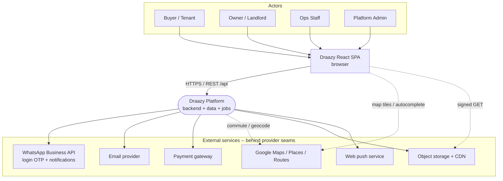
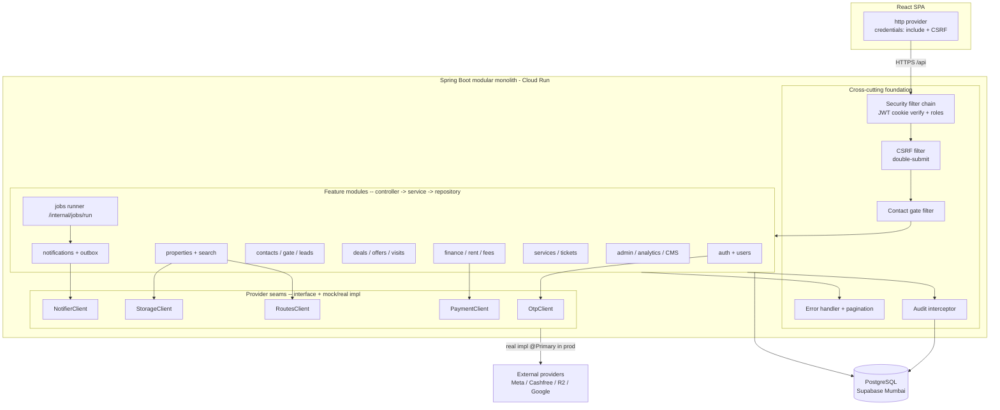
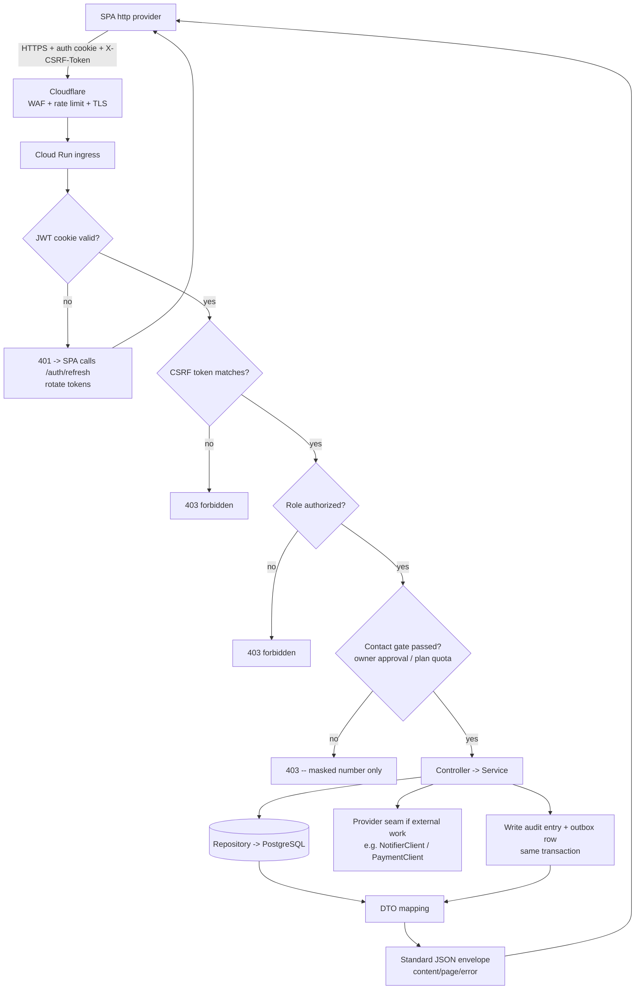
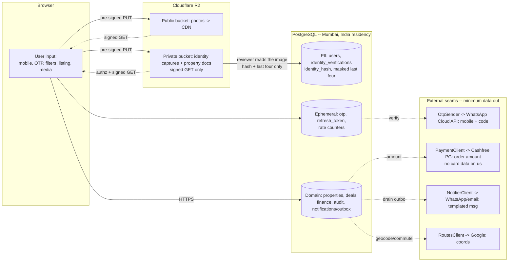
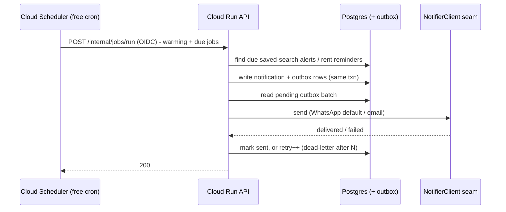
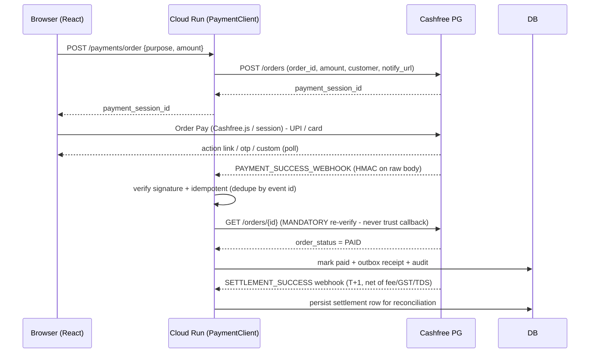
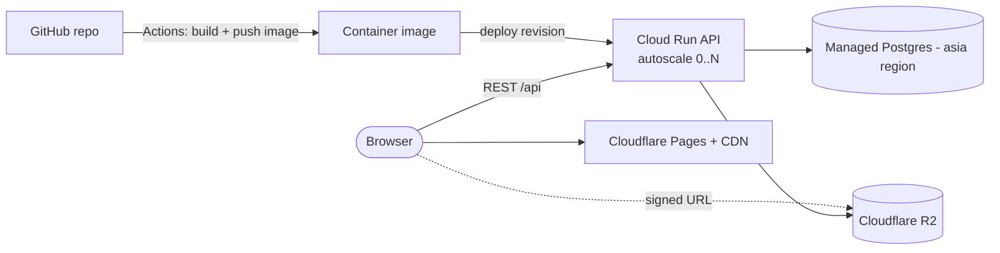

# Draazy — Platform & Solution Architecture (living doc)

> **Status:** MVP architecture pass complete — 23 ADRs ratified (ADR-001..021 incl. ADR-009a/009b)
> covering compute, database, auth/session, identity verification, notifications/jobs, search,
> storage, payments, cache/limits, the operational foundation, and **Cashfree as primary payments
> provider (ADR-017/018)**. All seven architecture views are drawn (§5.1–5.7: context, high-level,
> component, API-interaction, data-flow, sequences, deployment). This is the central place for
> platform architecture: component decisions, scoring, ADRs, assumptions, and Mermaid diagrams.
> **Verification follows a "badge, not gate" progressive-trust model (ADR-019; full design in
> §6.4 below) — identity verification is opt-in, reviewed in-house, and
> never blocks participation.**
> Remaining open items are non-blocking (§8).
>
> **Companion docs (do not duplicate):**
> - [`package-structure.md`](./package-structure.md) — the 11 bounded contexts → packages → schemas.
> - [`frontend-data-seam.md`](./frontend-data-seam.md) — how the React app reaches the API.
> - [`cross-cutting.md`](./cross-cutting.md) — auth/roles, contact gate, maker-checker, audit.
> - [`data-model.md`](./data-model.md) — ER map + persistence design.
> - [`OpenAPI spec`](../../backend/src/main/resources/static/openapi/draazy-api.yaml) — the REST contract (SSOT for wire shapes).
>
> **Design principles (early-stage):** decide every component on **Performance · Security · Cost ·
> Operational simplicity**. Prefer **managed services** when they save meaningful ops effort; keep a
> **clear path to millions of users**; call out **vendor lock-in** explicitly; never hard-delete;
> enforce trust rules server-side; run/demo with **zero paid keys** in dev (provider-seam pattern).

---

## 1. React application boundary (what the UI already assumes)

The React SPA is **complete** and talks only to `src/services/*Service.js`, which resolve to their
`providers/http/*` implementation over the live API. The frontend therefore already
dictates the backend surface. Reading the code + flow docs, the UI implies these external needs:

| UI capability (evidence) | Backend/platform component it implies |
| --- | --- |
| Passwordless sign-in, OTP screens (`auth.md`, `/auth/login`, `/auth/staff-login`) | **Auth service + JWT** and a **WhatsApp OTP** provider (ADR-020) |
| Opt-in identity badge, never a gate (`cross-cutting.md §3`, `VerifyIdentity.jsx`) | **Document + selfie capture, on-device OCR, staff review queue** |
| Property search with filters/sort/pagination (`search-listings.md`) | **Primary DB** + **search** (Postgres FTS → OpenSearch later) |
| Map view, commute, Places autocomplete (`@vis.gl/react-google-maps`) | **Google Maps / Places / Routes** APIs (client + server seam) |
| Contact reveal + owner-mobile masking (`contact-gate-leads.md`) | Server-enforced **gate + masking** in the API |
| Saved-search alerts, default channel **WhatsApp** (`saved-alerts.md`, `SavedSearch.channel`) | **Notification service** (WhatsApp/email/push) + **scheduler/jobs** |
| Owner↔buyer in-app chat (`Conversation` schemas) | **Messaging** persistence (realtime later) |
| Photo uploads, property docs, identity captures, reels (`list-property-wizard.md`, `Reel`) | **Object storage + CDN** (media transcoding later) |
| Plans, boosts, featured listing, rent-agreement platform fee (`plans-billing-refer.md`, `Fees`) | **Payment gateway** |
| Admin analytics dashboards (`analytics.md`, chart.js) | **DB aggregation** (analytics pipeline later) |
| Every mutation writes an audit entry (`AuditEntry`, maker-checker) | **Audit trail** (DB) |
| In-app notifications bell (`Notification`) | **Notifications** store + delivery |

---

## 2. Component inventory (prioritised for MVP → scale)

Grouped by when we need it. Deep-dive design (Purpose / Options / Recommendation / scoring) happens
one component at a time in §6 as we ratify each.

**Tier 0 — Platform foundation (decide first, gates everything):**
- Cloud platform & compute/hosting model
- Managed PostgreSQL (primary datastore)
- Secrets management
- CI/CD pipeline
- Object storage + CDN

**Tier 1 — Make the UI work (critical path to MVP launch):**
- Backend API (Spring Boot modular monolith) + **API gateway / ingress** (TLS, routing, rate limit)
- Authentication & Authorization (JWT) + **WhatsApp OTP** provider (ADR-020)
- **Identity verification** — document + selfie capture, on-device OCR, staff review queue
- Search (start: PostgreSQL full-text; upgrade path: OpenSearch/Elastic)
- File upload pipeline (pre-signed URLs to object storage)

**Tier 2 — Engagement, trust & monetisation:**
- Notification service — **WhatsApp Business**, **Email**, in-app; push later
- Background jobs / scheduler (saved-search alerts, rent reminders, cleanup)
- Cache (Redis) — hot reads, sessions/rate-limit counters, OTP throttle
- Payment gateway (plans, boosts, featured, paid services)

**Tier 3 — Scale & operations:**
- Observability (logs, metrics, traces, alerting) + uptime
- Audit trail hardening & retention
- Analytics pipeline (event stream → warehouse)
- Queue / event bus (decouple notifications, media, webhooks)
- Disaster recovery (backups, PITR, RPO/RTO targets)
- Media transcoding / streaming for reels
- WAF / advanced security controls

---

## 3. System Context Diagram (C4 level 1)



*Kept at context level on purpose. High-level, component, deployment, data-flow and sequence
diagrams are added in §5 as decisions firm up.*

---

## 4. Architecture roadmap (priority order)

1. **Ratify Tier 0 foundation** — cloud platform → compute model → managed Postgres → secrets → CI/CD → object storage.
2. **Auth spine** — JWT issuance + WhatsApp OTP seam (ADR-020); unblock every gated flow.
3. **Identity verification** — document + selfie capture, on-device OCR, and the staff review queue that decides them.
4. **Core API + search + file uploads** — the product's usable core (search, detail, list, contact).
5. **Notifications + jobs** — WhatsApp/email alerts, reminders.
6. **Cache + payments** — performance + monetisation.
7. **Observability, DR, analytics, queue** — harden for scale.

---

## 4.1 Free-tier-first cost map (target: no spend at MVP)

Founder constraint: spend nothing until real usage forces it. Every component must justify any
non-zero cost. Only one need has no free production tier anywhere: login OTP. Identity
verification costs nothing per check — capture is in the browser, OCR runs on the user's device,
and the decision is made by our own reviewer (§6.4).

| Need | Free-tier choice | Free allowance | First cost trigger |
| --- | --- | --- | --- |
| Compute / API | Google Cloud Run | 2M req/mo, scale-to-zero | sustained traffic / min-instances > 0 |
| Database | Supabase Postgres (Mumbai) | 500 MB Postgres | storage / row growth |
| Media + CDN | Cloudflare R2 + Pages | 10 GB, zero egress | > 10 GB stored |
| Push | Firebase FCM | unlimited | never |
| Email | Brevo / Resend | 300/day or 3K/mo | volume |
| WhatsApp — notifications (utility) | Meta WhatsApp Cloud API | free only inside an open 24h customer-service window (until Oct 1 2026) | any alert sent outside a reply window |
| Secrets | GCP Secret Manager | 6 active versions | many secrets |
| CI/CD | GitHub Actions | 2,000 min/mo | build minutes |
| Background jobs | Cloud Scheduler | 3 jobs free | > 3 scheduled jobs |
| Cache (Tier 2) | Upstash Redis | pay-per-request free tier | volume |
| Payments | Cashfree PG (₹0 fixed + free sandbox) (ADR-017) | no free usage tier; pay-per-successful-txn ~2% | first real payment (UPI fee applies despite 0% MDR) |
| Login OTP (WhatsApp, ADR-020) | none free in prod — `AUTHENTICATION` templates bill per delivered message | dev mock + Meta **test number** (5 verified recipients) | first real OTP |
| Identity verification | in-house: browser capture + on-device OCR + staff review | free — no per-check vendor fee at any volume | reviewer time, and object storage for the seven-day image window |

**Two corrections to the old "~1,000 free conversations/mo" assumption.** (a) Conversation-based
pricing was **replaced by per-message pricing on 1 Jul 2025** — Meta charges per *delivered template*,
by category and recipient country. (b) The free monthly allowance that survives (1,000/mo from
1 Oct 2026) covers **service** messages only, and a service message can only be sent inside an open
24-hour customer-service window. **Authentication templates are billed from the first message**, so
WhatsApp OTP is a per-login cost, not a free tier. Order of magnitude for India is low single-digit
paise-to-₹0.15 per delivered OTP — *treat that as a placeholder only*: the authoritative number is
the **INR rate card CSV** on Meta's pricing page, and rates can move quarterly (1 Jan / 1 Apr /
1 Jul / 1 Oct) with one month's notice. Volume tiers lower the rate as monthly authentication volume
grows, aggregated across the whole business portfolio.

---

## 4.2 Free-tier capacity — which limit we hit first

How much product the pure free tiers actually hold. The useful answer is not one number but
**which ceiling binds first**. Assumptions (adjust as reality lands): ~6-10 photos/listing,
client-side compressed to ~200-300 KB each = **~1.5-2.5 MB images/listing**; a listing row +
FTS `tsvector` + amenities JSONB + b-tree indexes = **~2-4 KB**; a user row ~0.5-1 KB.

| Free tier | Allowance | What consumes it | Ceiling |
| --- | --- | --- | --- |
| **Cloudflare R2** | 10 GB · 1M writes/mo · 10M reads/mo · **egress free** | listing photos, identity captures, property docs, reels | **~3,000-6,000 photo-backed listings** (10 GB ÷ ~2 MB). **Reels fill this fastest** — video is MBs *per clip* |
| **Cloud Run** | 2M req/mo (~66k/day) | every API call | **~1,500-3,000 active sessions/day** (20-50 calls/session) — a *traffic* wall, independent of stored volume |
| **Supabase Postgres** | 500 MB DB · 5 GB egress/mo | all rows + FTS indexes + audit/outbox/notifications | content is cheap (~15k listings + ~100k users ≈ 125 MB); the real risk is **write-amplifying tables** (audit, otp_codes, notifications/outbox) growing unbounded |

**Binding order.** (1) **R2 storage** is the tightest hard wall (~5k photo-backed listings; reels
fill it faster). (2) **Cloud Run requests** is the traffic wall on a busy day. (3) **Postgres 500 MB**
is the *last* wall for content **only if** audit/otp/notification retention is enforced — left
unpruned it becomes the *first* wall instead.

**Bottom line.** The free tiers comfortably carry a **Pune neighbourhood-scale MVP**: a few thousand
live photo-backed listings, **tens of thousands of registered users**, ~1.5-3k sessions/day. Scaling
past that is a **~USD 25/mo Supabase Pro upgrade + pennies-per-GB R2 overage** (R2 zero-egress ⇒
storage-only overage ~USD 0.015/GB-mo), **not a re-architecture** — the "clear path to millions
without rewrite" the ADRs target.

**Two caveats that are not capacity but bite in prod.** (a) **The first paid dollar is R2, not the
DB** — the moment photo-backed listings cross ~5k or reels get popular; it scales gracefully because
egress is free. (b) **Supabase free pauses after 7 days of *no DB connections* and offers only shared
CPU + a small direct-connection cap** — so a real prod app should move off the pausing tier early;
Pro (~USD 25/mo) is the first upgrade actually *needed*, well before the 500 MB fills (see §6.2).

---

## 4.3 DigitalOcean re-evaluation (ADR-021) — the numbers

Recorded 2026-09-05, prompted by the reasonable worry that GCP is expensive past its free tier.
Prices read from DigitalOcean's published pricing pages that day; **re-check before acting**, and
treat the Cloud Run figures as estimates rather than quotes.

**First, the scope of the worry.** Exactly one component of this platform is GCP: Cloud Run. Secret
Manager is free at our size and Cloud Scheduler was never built. Supabase runs on AWS; R2 and Pages
are Cloudflare; FCM is free forever. So "GCP cost" has one place to bite. Where the worry is
genuinely right is not the unit price but the *shape*: GCP has no hard spend cap, so its failure mode
is a bill you did not choose, whereas DigitalOcean's is a service that stops scaling. Those are not
equivalent risks for a solo founder even when the average price matches — and it very nearly does.

> **Correction, 2026-09-06 — the shape argument is now weaker than when this was written.** GCP has
> since added **spend cap budgets** (preview), and Cloud Run is one of the four eligible services.
> A spend cap scoped to one project and one service *does* stop: at 100% of the target amount new
> requests are blocked until the cap is manually lifted, enforcement runs on gross estimated costs so
> free-trial credit does not mask it, and nothing is deleted. That converts GCP's failure mode from
> "a bill you did not choose" into "a service that stops" — which is precisely the property this
> section credited DigitalOcean with. It does not change the decision, since Option A was already
> chosen and the deferral trigger is a *scale* event rather than a *risk* one, but it removes the
> main non-price reason to revisit. Caveats: preview, one service per budget (Artifact Registry and
> Secret Manager still need a separate alerts-only budget), monthly periods only, enforcement is not
> instantaneous so lag overage is still billed, and an alerts-only budget cannot be converted into
> one. Set up in `DEPLOY_WALKTHROUGH.md` §4.4.

**DigitalOcean has no free tier we can use.** App Platform's free tier is **3 apps with static
sites**, 1 GiB transfer each — a Cloudflare Pages substitute, not a Cloud Run one, and Pages is
already free *and* runs the `/api` proxy Function that §5.7.1's cookie topology requires. Managed
Postgres, Spaces and container instances have no free tier at all. The $200/60-day new-account credit
is a trial; pricing a platform against an expiring credit is how the surprise arrives in month three.

| Component | DigitalOcean | Note |
|---|---|---|
| App Platform, 1 vCPU / 512 MiB | $5.00/mo | **Unusable for this app** — see below |
| App Platform, 1 vCPU / 1 GiB | $10.00/mo | the real floor |
| Managed Postgres, 1 GiB / 10 GiB disk | $15.15/mo | + $0.215/GiB/mo; PgBouncer included |
| Dev database, 512 MiB | $7.00/mo | App Platform only, no backups — **not for production data** |
| Spaces | $5.00/mo | 250 GiB + 1 TiB egress, then $0.01/GiB |

**Why the $5 tier is a trap, specifically here.** It is the same arithmetic as the `memory: 1Gi` limit
in `backend/deploy/cloudrun-sandbox.yaml`: `-XX:MaxRAMPercentage=75.0` on 512 MiB leaves a 384 MB heap
and 128 MB for everything else, and Spring Boot 4 plus Hibernate across ~99 repositories spends more
than that on metaspace alone. It does not OOM under load — it OOMs *during startup*, after the health
check has begun waiting, which reads as a failed deploy rather than an undersized plan.

**The comparison that matters is not free-vs-paid, it is working-vs-working.**

| | Sandbox today | Configured to actually work |
|---|---|---|
| **Cloud Run + Supabase** | **$0** — but no sweep has ever run (ADR-011) and the DB pauses after 7 days idle (§4.2) | ~$35-40 (always-on Cloud Run ~$10-25 + Supabase Pro $25) |
| **DigitalOcean** | ~$25 | **~$25** — nothing to fix |

DO is *cheaper* at the configuration that works, and identical in behaviour to the expensive GCP one.
The reason is that both of GCP's remedies cost money that DO's baseline already includes: always-on
CPU to make `@Scheduled` fire, and Supabase Pro to stop the pause.

**Why the sandbox stays on Cloud Run anyway.** It is $0, the config is written and security-reviewed,
and the broken sweeps genuinely do not matter yet — nobody can sign in until Meta verifies the
business account (ADR-020), which is weeks out. Paying $25/mo to expire subscriptions for zero users
is spending money to no effect. **The trigger for revisiting is whichever comes first: the first
paying user, or the moment Supabase Pro becomes necessary** — at that point the GCP option costs more
than the DO one and the comparison above stops being hypothetical.

**What is kept regardless.** R2 (zero-egress is the property ADR-013 relies on; Spaces would cost
$5/mo to buy storage headroom we will not need for years and to give that property up) and Cloudflare
Pages including the `/api` Function. Moving the proxy off Cloudflare breaks the same-site cookie
topology and kills every session fifteen minutes after login.

---

## 5. Diagrams

All seven standard views are complete: **5.1** System Context · **5.2** High-Level Architecture ·
**5.3** Component · **5.4** API Interaction Flow · **5.5** Data Flow · **5.6** Sequences (5) ·
**5.7** Deployment.

### 5.1 System Context
See section 3.

### 5.2 High-Level Architecture (free-tier-native)

```mermaid
graph TB
    USER([Browser])

    subgraph Edge[Cloudflare -- free]
        PAGES[Cloudflare Pages<br/>React SPA + CDN]
        WAF[Edge WAF + rate limit<br/>+ Turnstile]
        R2[(Cloudflare R2<br/>media - zero egress)]
    end

    subgraph GCP[Google Cloud -- free tier]
        RUN[Cloud Run<br/>Spring Boot API<br/>scale-to-zero - asia-south1]
        SCHED[Cloud Scheduler<br/>jobs + warming ping]
        SEC[Secret Manager]
    end

    DB[(Managed Postgres<br/>Supabase Postgres (Mumbai)<br/>+ outbox, audit, counters)]
    FCM[Firebase FCM<br/>push - free]

    subgraph Seams[External providers -- behind seams, pay-per-use]
        WA[WhatsApp Cloud API<br/>login OTP + notifications]
        MAIL[Email - Brevo/Resend]
        PAY[Cashfree PG - hosted checkout]
        MAPS[Google Maps/Places/Routes]
    end

    USER --> WAF --> PAGES
    PAGES -->|HTTPS /api| RUN
    PAGES -.signed GET.-> R2
    PAGES -.map + autocomplete.-> MAPS
    RUN --> DB
    RUN -->|pre-signed PUT| R2
    RUN --> FCM
    RUN --> WA
    RUN --> MAIL
    RUN --> PAY
    RUN -.geocode + commute.-> MAPS
    SEC -.secrets.-> RUN
    SCHED -->|OIDC /internal/jobs/run| RUN
    RUN -.pg_dump backup.-> R2
```

### 5.3 Component Diagram

Internal structure of the Spring Boot **modular monolith** (ADR-001), package-by-feature with shared
cross-cutting foundations and external work isolated behind **provider seams** (ADR-004).



### 5.4 API Interaction Flow

The path of a single authenticated, gated request (e.g. `POST /contacts/request`) through the edge and
the cross-cutting chain before it reaches domain logic.



### 5.5 Data Flow Diagram

How data moves and where PII lives. **Rule:** PII stays in the Mumbai DB; only the minimum leaves to a
seam; a raw document number is **never** stored (only the identity_hash + masked last four, ADR-009b),
and the captured images are deleted seven days after a decision.



### 5.6 Sequence Diagrams

**OTP login + httpOnly-cookie session (ADR-008).** First flow ratified; contact gate next.

```mermaid
sequenceDiagram
    participant U as Browser (React SPA)
    participant P as Vite proxy / Cloudflare (/api)
    participant API as Cloud Run (Spring Boot)
    participant DB as Postgres (Supabase)
    participant SMS as OtpSender seam (WhatsApp Cloud API)

    U->>P: POST /auth/otp {mobile}
    P->>API: forward
    API->>DB: store OTP (hash, expires, attempts=0)
    API->>SMS: send OTP (mock in dev)
    API-->>U: 200 (OTP sent)

    U->>P: POST /auth/login {mobile, otp}
    P->>API: forward
    API->>DB: verify OTP hash + TTL + attempts
    API->>DB: create rotating refresh token (family, hash)
    API-->>U: 200 + Set-Cookie: access (15m) + refresh (httpOnly, Secure, SameSite=Lax) + XSRF cookie

    Note over U,API: Subsequent calls: browser auto-sends cookies; SPA adds X-CSRF-Token on mutations
    U->>P: GET /api/... (cookie access JWT)
    P->>API: forward
    API-->>U: 200 (stateless JWT verify, no session lookup)

    Note over U,API: On 401 (access expired)
    U->>P: POST /auth/refresh (refresh cookie)
    P->>API: forward
    API->>DB: validate refresh; detect reuse -> revoke family if replayed
    API->>DB: rotate refresh token
    API-->>U: 200 + Set-Cookie: new access + new refresh
```

**Contact gate: request approval, with the badge alongside it and never in front of it (ADR-009b/019).**

```mermaid
sequenceDiagram
    participant U as Buyer (SPA)
    participant API as Cloud Run API
    participant DB as Postgres
    participant N as Notify (owner)

    Note over U,API: Contact request — the badge is not consulted
    U->>API: POST /contacts/request {propId}
    API->>DB: create request status=pending; owner number masked
    API->>N: notify owner (WhatsApp/in-app)
    API-->>U: 201 pending (number masked)

    Note over U,API: Owner decides; only approval reveals the number
    U->>API: GET /contacts/{id}
    alt owner approved
        API-->>U: 200 (number revealed, quota decremented)
    else pending or declined
        API-->>U: 200 (still masked)
    end

    Note over U,API: Listing creation (owner) — also L1 mobile only
    U->>API: POST /properties (owner)
    API->>DB: allow listing (status=pending review)
    API-->>U: 201 created
```

**Scheduled alert / reminder via Cloud Scheduler + outbox (ADR-010/011).**



**Identity verification: capture on the device, decided by a person (ADR-009b/019, §6.4).**

```mermaid
sequenceDiagram
    participant U as Browser (React)
    participant OCR as Tesseract wasm (same device)
    participant API as Cloud Run API
    participant R2 as R2 private bucket
    participant DB as Postgres
    participant S as Staff reviewer (ops queue)

    U->>U: camera capture - document front (+ back for Aadhaar / DL)
    U->>U: live selfie - smile, turn left, turn right
    U->>OCR: read the card, on this device
    OCR-->>U: number, name, DOB (prefilled, correctable - never evidence)

    U->>API: POST /me/verification/identity (multipart: docType, images, claims)
    API->>API: attempt cap - 3 per rolling 24h, under a row lock
    API->>R2: store images (private)
    API->>DB: case status=pending; claims kept as hash + last4 only
    API-->>U: 202 Accepted - queued, no badge

    Note over S,DB: A person decides; nothing the client said is believed
    S->>API: GET the queue (images via short-lived signed URLs)
    S->>API: approve / reject (with reason)
    alt approve
        API->>DB: set identity_hash UNIQUE (at approval, not at submit)
        alt that document is already verified elsewhere
            API-->>S: 409 identity_already_registered
        else
            API->>DB: users.verified = true
        end
    else reject
        API->>DB: status=rejected + reason; applicant may retry
    end
    API->>R2: purge images 7 days after the decision (IdentityFilePurgeSweep)
```

**Payment (fee collection) via Cashfree PG (ADR-017, verify-then-fulfil).**



### 5.7 Deployment Diagram (MVP, no spend)



#### 5.7.1 The UI and the API must share one registrable domain

The session's long-lived half is an `HttpOnly`, `SameSite=Lax` cookie (`__Host-draazy_rt`), so the
browser returns it to `POST /api/auth/refresh` only when the page making that call and this API are
the same *site*. That makes hosting topology a load-bearing part of the auth design rather than an
operational detail, and the failure mode is why it is written down here: a cross-site frontend gets
its cookie withheld **silently** — no error, no CORS message — so every session dies fifteen minutes
after login and the server log looks exactly like a stream of visitors who were never signed in. Dev
and e2e cannot surface it, because the Vite proxy makes everything same-origin there.

Two arrangements satisfy it, and the code supports both without modification:

| Arrangement | Example | Cross-origin? | What it needs |
| --- | --- | --- | --- |
| **Path proxy** (simplest) | `draazy.com` serves the SPA and forwards `/api/*` to Cloud Run | No | Nothing. No CORS involved at all |
| **Sibling subdomains** | `www.draazy.com` → `api.draazy.com` | Yes, but same-*site* | `WEB_ORIGINS` listing the UI origin exactly; `CorsConfig` already sets `allowCredentials` |

The two are not equivalent, and the path proxy is the one to choose. The readable
`__Host-draazy_session` marker that drives the Safari-ITP session recovery is scoped by *host* —
`document.cookie` always is, and the `__Host-` prefix forbids the `Domain` attribute that would widen
it — so on sibling subdomains a page on `www.` cannot see a marker set by `api.`. Refresh still works
for everyone else; what is lost is the recovery for the Safari visitor who returns after seven days,
and it is lost **silently**, which is the same shape of bug this whole section exists to prevent.
`CookieDeliveryCheck` therefore warns about that topology by name at boot. The tempting repair —
giving the marker a `Domain` — is worse than the problem: it drops the prefix and lets any sibling
host shadow our cookies, turning the automatic cold-boot restore into session fixation.

Subdomain hygiene follows from that: nothing under the cookie's registrable domain should point at a
third-party SaaS, no wildcard DNS, and no dangling `CNAME` records. A host an attacker can claim is a
host that can write cookies into our jar.

What breaks it is a frontend on its own registrable domain. Every vendor preview host is exactly
that — `*.netlify.app`, `*.pages.dev`, `*.vercel.app` are all Public Suffix List entries, so
`draazy.pages.dev` and any `api.*` host are different sites. This is resolved by construction rather
than by rule: the SPA is served from a custom domain (`sandbox.draazy.com` first) and reaches the API
through a same-origin `/api` path proxy, `frontend/functions/api/[[path]].js`, so nothing ever
crosses a site boundary. It does mean the vendor preview URL cannot be used for anything requiring a
session. `SameSite=None` would restore delivery on a cross-site shape but is not a free repair — it
deletes the argument for `/auth/refresh` carrying no CSRF token, so it would have to be paid for with
a double-submit token or an Origin allow-list.

Because none of this shows up at runtime, `CookieDeliveryCheck` compares `API_PUBLIC_ORIGIN` against
every entry in `WEB_ORIGINS` at startup and refuses to boot on a topology that cannot work, naming
both fixes in the message. A silent, total, production-only failure becomes a container that does not
start. It additionally warns — without failing — on the same-site-but-not-same-host case above, where
only the ITP recovery is lost.

One-off cost of the cookie rename: every already-signed-in user is signed out once on the deploy that
introduces `__Host-draazy_rt`, because their existing `draazy_rt` cookie is no longer looked for.
No data is lost and the next sign-in is normal; it is worth a line in the release note rather than a
support surprise.

## 6. Component deep-dives (added as ratified)

### 6.1 Cloud platform and compute

- **Purpose.** Where the backend API runs and how it scales.
- **Why required.** The SPA needs a hosted REST API that costs nothing when idle, scales on demand,
  and avoids server toil for a tiny team.
- **Options considered.**
  - DigitalOcean Droplet/App Platform + managed PG - predictable, low lock-in, but no free tier.
  - AWS ECS/Fargate + RDS - broad, but no true scale-to-zero and RDS has a monthly floor.
  - Google Cloud Run + managed Postgres - genuine free tier, scale-to-zero, runs our container.
  - Full Firebase/Firestore BaaS - rejected (ADR-006): wrong for a relational, filter-heavy domain.
- **Recommendation.** Cloud Run (asia-south1 Mumbai) running the Spring Boot container, with a
  managed Postgres free tier. Portable container + standard Postgres keep lock-in low (escape hatch
  to any container host).
- **Container contract.** Cloud Run injects `PORT` and routes traffic only to a container listening
  on it, so the app binds `server.port=${PORT:8080}` rather than a fixed port. Getting this wrong
  fails the health check while the process itself looks healthy, so the revision never receives
  traffic and the logs show nothing wrong. The `8080` default keeps local `spring-boot:run` and the
  Vite proxy working unchanged. Pinned by `ProdProfileContractTest`.
- **Security.** Managed TLS, no SSH surface, per-service IAM, secrets injected from a secret store,
  private egress to the database.
- **Performance.** Autoscale 0->N; watch cold starts (raise min-instances to 1 once traffic
  justifies). Mumbai region = low latency for Pune users.
- **Cost.** Zero within free tier (2M req/mo, scale-to-zero); pay only past free limits.
- **Future scale.** Raise min/max instances; add revisions/canary; if ever needed, lift the same
  container to GKE or another host with no code change.
- **Score - Performance 8 | Security 8 | Cost 9 | Ops simplicity 9.**
### 6.2 Database (managed Postgres)

- **Purpose.** Primary system of record for all relational domain data.
- **Why required.** The domain is relational and transactional (properties, deals, offers, finance,
  audit, maker-checker); needs strong filtering/search and integrity guarantees.
- **Options considered.**
  - Supabase Postgres (Mumbai, ap-south-1) - real Postgres, India region, free tier.
  - Neon (Singapore) - scale-to-zero + branching, but no India region (offshore PII).
  - Cloud SQL for Postgres - great with Cloud Run, but no free tier (monthly floor).
  - Self-managed Postgres on a VM - cheapest raw, but ops toil + backups on us.
- **Recommendation.** Supabase Postgres in Mumbai, used strictly as a Postgres host: our own Flyway
  migrations, our own JWT auth (Supabase Auth/Realtime/Edge unused) to keep lock-in low. Connect via
  the Supabase pooler (Supavisor/PgBouncer, transaction mode) because Cloud Run is serverless and
  spins many short-lived connections; keep the HikariCP pool small per instance.
- **Security.** TLS in transit; PII stays in an India region (DPDP posture); least-privilege
  DB user; credentials in Secret Manager; daily automated backups; app-level authz (no public API).
- **Performance.** Co-located with Cloud Run in Mumbai for low latency; pooler prevents connection
  exhaustion; targeted indexes for search filters; JSONB for flexible/array fields.
- **Cost.** Free tier (500 MB, shared compute) at MVP; move to Supabase Pro (~USD 25/mo) only when
  storage/connections/PITR are needed.
- **Future scale.** Read replicas, larger compute, PITR; if ever needed, migrate to Cloud SQL/RDS
  (standard Postgres = portable, no app rewrite); partition hot tables.
- **Score - Performance 8 | Security 8 | Cost 9 | Ops simplicity 9.**
### 6.3 Authentication and session security

- **Purpose.** Prove who a user is (passwordless mobile OTP) and carry that identity + role on every
  request, without a server-side session store (honours ADR-003 stateless JWT).
- **Why required.** Every gated flow (contact reveal, listing, deals, finance, admin) needs an
  authenticated identity and role. Token storage is the #1 SPA attack surface, so it is decided here.
- **Login model.** Passwordless mobile OTP (`/auth/login`); internal `/auth/staff-login`. No passwords.
  OTP is generated server-side and stored **hashed** in Postgres (`otp` table: mobile, hash,
  expires_at, attempts) so verification works across scale-to-zero Cloud Run instances (no in-memory
  state). Rate-limited and attempt-capped.
- **Options considered.**
  - **A. Both tokens in `localStorage` (Bearer).** Simplest, but readable by any XSS payload. Rejected.
  - **B. Access token in memory + refresh in httpOnly cookie.** Good, but the access token still lives
    in JS and is exfiltratable while resident.
  - **C. Both tokens in httpOnly cookies + CSRF token (chosen).** JavaScript can never read the token.
- **Recommendation.** **Option C.** Short-lived (~15 min) HS256 access JWT (roles + `team[]` in claims)
  and a long-lived **rotating** opaque refresh token, both delivered as **httpOnly + Secure +
  SameSite=Lax** cookies. Refresh tokens are stored server-side (`refresh_token` table: hash, user,
  family, expires, revoked) enabling **rotation + reuse-detection** (a replayed old token revokes the
  whole family) and server-side revocation. `/auth/refresh` rotates the cookie. **CSRF** handled by a
  double-submit token (readable `XSRF` cookie echoed in an `X-CSRF-Token` header) on all mutations.
  > **Partly superseded — see "As built" below.** Only the *refresh* token became a cookie; the access
  > token is still a Bearer. That is what retires the double-submit CSRF token too: with every mutation
  > authenticated by a header no foreign origin can set, there is nothing for a forged cross-site
  > request to ride on. The paragraph is kept because it records the decision this one departs from.
- **Local feasibility.** A **Vite dev proxy** makes the SPA and API same-origin, so the cookie is
  first-party, `SameSite=Lax` "just works", and there is no CORS/cross-site-cookie pain. Prod serves
  the API under the same registrable domain (Cloudflare route `/api` or `api.` subdomain + cookie domain).
- **Frontend impact.** Contained to the `http` provider: stop attaching `Authorization: Bearer`, send
  `credentials: 'include'` + the CSRF header. **Components never change** (honours "UI is done").
  > **Superseded.** `Authorization: Bearer` stayed, and no CSRF header was added; `credentials:
  > 'include'` did land. The prediction that held is the one that mattered: the change was contained
  > to the `http` provider and no component was touched.
- **Security.** httpOnly blocks JS token theft; Secure forces HTTPS; SameSite blocks cross-site send;
  short access TTL limits blast radius; rotation + reuse-detection contain refresh replay; CSRF token
  blocks forged mutations; OTP hashed + throttled.
- **Performance.** Stateless JWT verify (no session lookup) is fast; ~one `/auth/refresh` per 15 min;
  `otp`/`refresh_token` tables are tiny and indexed.
- **Cost.** Zero (Postgres tables only). OTP send cost applies only in prod, behind the `OtpSender` seam.
- **Operational prerequisite / risk.** **Superseded by ADR-020.** This originally read "real SMS OTP
  in India requires DLT/TRAI registration (registered entity, sender ID, approved templates) before
  go-live" — choosing WhatsApp as the OTP channel removes DLT from the critical path entirely. The
  prerequisite is now **Meta business verification + an approved `AUTHENTICATION` template**. Free in
  dev via the mock seam.
- **Future scale.** Move the refresh-token store to Redis for faster revocation checks; add a device/
  session list with "log out everywhere"; step-up auth for sensitive operations.
- **Score - Performance 8 | Security 9 | Cost 9 | Ops simplicity 7.**
- **As built (2026-08-31).** Half of C, and deliberately so: the **refresh** token is an `HttpOnly;
  Secure; SameSite=Lax; Path=/` cookie (`__Host-draazy_rt`), while the **access** token is still a
  `localStorage` Bearer. Splitting them this way took the month-long credential out of JavaScript's
  reach without rewriting every authenticated call. Be precise about the benefit, because the
  obvious phrasing is wrong: `HttpOnly` stops a payload *reading* the refresh token, not *using* it —
  same-origin script can still `POST /auth/refresh` with `credentials: 'include'` and read the new
  access token out of the response. What it prevents is **exfiltration**: the token cannot be shipped
  to the attacker's own server, so the capability dies with the compromised page instead of granting
  thirty days of offline re-authentication afterwards. That makes XSS the dominant risk to this
  credential, and dropping `'unsafe-inline'` from `script-src` (see `frontend/public/_headers`) the
  mitigation that actually moves the number.
  Two consequences follow from moving only one token. **CSRF stays unnecessary** — the cookie is
  POST-only under an explicit `SameSite=Lax`, so a forged cross-site POST to `/auth/refresh` arrives
  with no cookie at all; every mutation still authenticates by a header no other origin can set. And
  the client lost its ability to break a refresh race by
  comparing the stored token, so the server forgives a replay landing within seconds of the rotation
  it lost (`draazy.security.jwt.refresh-grace`).
  Finishing C — access token in memory, CSRF double-submit — remains open, and is now a change to the
  access token alone.
  **The `__Host-` prefix replaced the `/api/auth` path scoping, and that is a net gain.** Path
  scoping only ever guarded against our own code forwarding or logging a request carrying the cookie,
  and nothing here logs cookies or headers. The prefix, which browsers enforce by refusing to store
  the cookie at all unless it is `Secure`, `Domain`-less and at `Path=/`, guards against something we
  could not otherwise stop: any other host under the registrable domain planting a `Domain`-scoped
  twin that neither side can clear. With the ITP restore below now resuming sessions automatically at
  cold boot, that twin would be a fully automated session fixation — the victim's browser signing
  itself into the attacker's account with no interaction. The cookie names are therefore derived at
  runtime from `refresh-cookie.secure` (prefixed in production, bare over plain-HTTP dev where a
  browser would reject the prefix), and both shapes are pinned by test rather than left to whichever
  profile CI happens to run.
  **A second, deliberately readable cookie rides beside it.** `__Host-draazy_session` (`Path=/`, not
  `HttpOnly`, same `Max-Age`/`Secure`/`SameSite`, cleared by the same logout) exists because Safari's
  ITP evicts *script-writable* storage at seven days and spares server-set cookies. Without it a
  remembered Safari user reached day eight with an empty `localStorage` and a refresh cookie good for
  three more weeks that nothing would ever spend — an absent access token reads as "signed out"
  everywhere else in the client, correctly, so the boot path needed its own signal rather than a
  loosening that would cost every anonymous visitor a `/auth/refresh`. Its value (`1`/`0`) also
  carries whether the session was meant to persist: `remember` must be restated on each rotation, and
  the client used to infer it from which storage tier held the tokens — precisely what the eviction
  destroys, so without the second bit the rescuing refresh would trade a 30-day cookie for a session
  one. It holds no identity and no secret; an XSS that reads it learns only what a bare
  `POST /auth/refresh` would already reveal.
### 6.4 Identity verification (the Verified badge)

- **Purpose.** Let a person prove they are a real, document-holding human, and show that to the other
  side of a listing as a **badge**. It is a trust signal, never a precondition: browsing, posting and
  requesting contact all stay at L1 mobile (ADR-019, §6.4).
- **Why in-house (the decision that replaced the vendor).** Every hosted e-KYC route we costed was a
  per-check fee on a funnel that is *opt-in*, i.e. exactly the funnel you cannot afford to meter. The
  three things a vendor was buying us — a licensed Aadhaar retrieval, a liveness check, and a document
  read — are each available to us for free at the quality a *badge* needs: we do not need UIDAI-grade
  authentication to say "a person on our team looked at this card and this face".
- **Legal constraint (still decisive, and why the shape is what it is).** Direct UIDAI Aadhaar OTP
  e-KYC is restricted to licensed **AUA/KUA** entities and we do not qualify. So we never authenticate
  an Aadhaar number against UIDAI, and we never ask for one to be typed in. Aadhaar is accepted here
  only as **one of three photographable documents** — the same standing as a PAN card or a driving
  licence — and what we retain of it is a keyed hash and the last four digits.
- **How the flow works.**
  1. **Capture, camera-only.** The applicant photographs a government document (**Aadhaar, PAN card,
     or driving licence**; Aadhaar and driving licence also need the back) and then records a **live
     selfie with liveness stages** — smile, turn left, turn right. File pickers are not offered: a
     still that was never taken by this device is the whole attack this step exists to make awkward.
  2. **OCR on the device.** A Tesseract wasm build reads the card in the browser. This is a
     *convenience*, not evidence — it prefills the number, name and DOB so the applicant can correct
     a misread before a reviewer's time is spent.
  3. `POST /me/verification/identity` (multipart) → **202 Accepted**. Acceptance into the queue is
     deliberately not a decision, and the response carries no badge.
  4. **A person decides.** The case lands in the ops identity review queue
     (`OpsIdentityReview.jsx`), where a trained reviewer sees the images, the OCR claims, and any
     same-document or same-person collisions, and approves or rejects with a reason.
- **Nothing the client says is believed.** The OCR `claims` are stored only as a hash and a last-4, so
  the queue can flag two cases carrying the same card; the badge is keyed on what the **reviewer**
  reads off the image. That is also why the UNIQUE `identity_hash` is written **at approval**, not at
  submit — otherwise a forged claim could permanently block the real holder from ever verifying.
- **Uniqueness / dedup — a keyed hash, never the number (ADR-009b).**
  `identity_hash = HMAC-SHA256( docType | canonical_number )` under `IDENTITY_HASH_SECRET`, stored
  **UNIQUE**. HMAC rather than a plain digest because an Aadhaar number's input space is only ~10¹¹ —
  an unkeyed hash is brute-forceable from a leaked dump, a keyed one is useless without the key. The
  type namespace stops a PAN ever colliding with a licence. A second account presenting the same card
  gets **`409 identity_already_registered`**, which caps one badge per document without gating
  anything. Rotating the key orphans every existing hash, so the deploy guide marks it **set-once**.
- **`person_key` is a reviewer signal, not a rule.** `HMAC( normalize(name) | dob )` groups likely-same
  humans across different cards, where spelling legitimately differs. It surfaces in the queue and
  never rejects on its own.
- **Abuse cap.** Three submissions per rolling 24 hours, counted on the user's own row under a row
  lock. Every submit costs a reviewer's time, which is the scarce resource here rather than an API
  quota.
- **What we store.** `user_id`, `status`, `doc_type`, `doc_last4`, the keyed `identity_hash` (at
  approval) and `person_key`, submitted/decided timestamps, and the rejection reason + note. **Never**
  a raw document number. The captured images live in the **private** bucket behind short-lived signed
  GETs and are **deleted `retention-days` (7) after the decision** by `IdentityFilePurgeSweep`; the row
  survives with only last-4, name and DOB.
- **Security.** Capture and OCR happen on the applicant's device; only the images and a hashed claim
  cross the wire. Images are never public — reviewers read them through short-lived signed URLs, and
  the review panel withdraws its own links before the shortest server-side lifetime expires. PII stays
  in the Mumbai DB; `IDENTITY_HASH_SECRET` lives in Secret Manager.
- **Performance.** One-time per user and entirely off the hot path. The badge check on a render is a
  cheap boolean on `users.verified`; `identity_hash` is indexed for dedup. There is no outbound call,
  no redirect hop and no webhook, so nothing here is hostile to Cloud Run scale-to-zero.
- **Cost.** **Zero per check.** Capture is the user's camera, OCR is the user's CPU, and the decision
  is our reviewer. What it does cost is *reviewer minutes* and the object storage holding images for
  their seven-day window — both of which scale with real verifications rather than with attempts,
  because of the attempt cap above.
- **Dev.** No reviewer sits behind a developer machine, so `POST /me/verification/identity/simulate`
  (`@LocalOnly`) decides a case that has genuinely been filed. It **404s without one** — it is a
  decision endpoint, not a badge dispenser — which is the property that keeps it honest.
- **Future scale.** Server-side liveness scoring and a document-authenticity model to triage the queue
  before a human opens it; a re-verification cadence; a licensed AUA/vault integration behind the same
  service if court-grade uniqueness is ever required.
- **Score — Performance 9 | Security 8 | Cost 10 | Ops simplicity 6.** (Cost 10: no vendor, no
  per-check fee. Security 8: no number ever authenticated against UIDAI, but we do hold images for
  seven days. Ops 6: it is a **queue with people in it** — the operational cost moved from a vendor
  integration to a staffing commitment, and that is the real trade.)
### 6.5 Notifications and background jobs

- **Purpose.** Deliver saved-search alerts (UI default channel = WhatsApp), rent/visit reminders,
  contact-request updates, and the in-app notification bell.
- **Why required.** Alerts/reminders/bell are core engagement, and most are **schedule-triggered**,
  not click-triggered - which collides with scale-to-zero compute (below).
- **Channels (all behind one `NotifierClient` seam, mock in dev).**
  - **WhatsApp - Meta WhatsApp Cloud API direct** (~1,000 conversations/mo free; needs a Meta business
    account + template approval). A BSP (Twilio/Gupshup) is rejected for MVP: paid markup + lock-in.
  - **Email - Brevo/Resend** free tier (300/day).
  - **In-app - a `notifications` Postgres table** the SPA polls (realtime via FCM later).
  - **Push - FCM** (ratified, free), later.
- **Delivery reliability - transactional outbox.** A mutation writes a `notification`/`outbox` row in
  the **same DB transaction**; a drainer job sends via the seam and retries on failure, so a
  scaled-to-zero/cold instance never loses a message. Upgrade path: a real queue (Pub/Sub) + worker.
- **Background jobs under scale-to-zero.**
  - **Trigger - Cloud Scheduler** (free, 3 jobs) -> a secured internal endpoint
    `POST /internal/jobs/run` (OIDC/shared secret). Fires reliably even when the app is at zero
    instances, and there is **no duplicate-send** problem (single external trigger).
  - **Rejected** for $0 MVP: in-process `@Scheduled` (skips when scaled to zero; double-fires when
    scaled out -> would need ShedLock).
  - **Cold-start strategy.** Enable Cloud Run **startup CPU boost** + `spring.main.lazy-initialization`,
    and add a Cloud Scheduler **warming ping** (~5 min) to keep one instance warm during active hours at
    **~$0** (default request-based billing charges CPU only during requests). First visitor after long
    idle waits ~2-4s; everyone hitting a warm instance gets millisecond responses.
- **Recommendation (ratified).** Meta WhatsApp Cloud API + Brevo + Postgres in-app behind the seam,
  with a transactional outbox; jobs via Cloud Scheduler -> internal endpoint + warming ping. Move to
  **`min-instances=1` + native `@Scheduled` + ShedLock** only when traffic/revenue justify ~$10-20/mo
  (also removes cold starts); GraalVM native image later for ~100ms starts.
- **Security.** Internal jobs endpoint via Scheduler->Run OIDC/IAM or shared secret; WhatsApp/email
  keys in Secret Manager; templated messages; per-user notification prefs / opt-out respected.
- **Performance.** Alerts/reminders run as batch off the hot path; in-app bell is a cheap indexed
  query; the outbox drains in small batches.
- **Cost.** $0 within free tiers (Scheduler 3 jobs, WhatsApp ~1,000 conv, Brevo 300/day, Postgres
  outbox); channel costs only past volume.
- **Future scale.** Pub/Sub + dedicated worker; websockets/FCM realtime bell; per-channel rate
  limiting; dead-letter queue for poison messages.
- **Score - Performance 8 | Security 8 | Cost 9 | Ops simplicity 7.**
### 6.6 Search and discovery

- **Purpose.** Property discovery: filters (locality, BHK, price range, type, amenities), sort,
  pagination, map/geo radius, and text search.
- **Why required.** `search-listings.md` is the product's primary surface - everything funnels through it.
- **Domain insight.** Real-estate search is **mostly structured filtering + geo**, not free-text
  relevance ranking; locality autocomplete is already served by **Google Places** on the map side. So
  the "search-engine relevance" need is much smaller here than in e-commerce.
- **Options considered.**
  - **A. PostgreSQL** - composite/B-tree indexes for filters, `tsvector` FTS for text, `pg_trgm` for
    fuzzy/autocomplete, **PostGIS** for radius/geo. $0, one datastore, no index-sync lag.
  - B. Meilisearch/Typesense - typo-tolerant, instant facets; free self-host/generous tier, but a
    second datastore to keep in sync.
  - C. OpenSearch/Elastic - powerful but heavy ops; overkill for MVP.
  - D. Algolia - best DX/relevance, but per-search cost cliff + lock-in. Rejected early-stage.
- **Recommendation (ratified).** **Option A - PostgreSQL** (composite indexes + `tsvector` + `pg_trgm`;
  add **PostGIS** when map-radius search lands), **behind a search seam/repository** so we can swap to
  Meilisearch/Typesense later without touching callers. Free, one datastore, no sync complexity,
  co-located with the data.
- **Security.** Standard DB authz; no new attack surface.
- **Performance.** Composite/partial indexes keep filter queries fast well past MVP; use **keyset
  (cursor) pagination** to avoid deep-offset slowdowns; GIN indexes for FTS/trigram/JSONB amenities.
- **Cost.** $0 - inside the Postgres we already run.
- **Future scale.** Introduce Meilisearch/Typesense (typo-tolerance, instant facets, relevance tuning)
  fed from the outbox/CDC when relevance/volume outgrows Postgres.
- **Score - Performance 7 | Security 9 | Cost 9 | Ops simplicity 9.** (Perf 7: raw relevance/typo-tolerance
  weaker than a dedicated engine - fine for structured search.)
### 6.7 File storage and media uploads

- **Purpose.** Hold property photos, listing documents, identity captures, and reels; serve them fast via CDN.
- **Why required.** The list-property wizard and reels require uploads; identity captures and property docs require
  **private** storage (PII).
- **Ratified store.** Cloudflare R2 (ADR-005) - 10 GB free, **zero egress**, S3-compatible.
- **Upload path.**
  - **A. Pre-signed PUT (direct-to-R2, chosen)** - API issues a short-lived signed URL; the browser
    uploads **straight to R2**. The API never touches the bytes -> saves Cloud Run compute/bandwidth,
    dodges the ~32 MB request cap (vital for reels).
  - B. Proxy through the API - simpler, but burns compute/bandwidth and hits the request-size cap.
- **Access model.** **Split buckets**: listing **photos -> public bucket via CDN** (cacheable);
  **Identity captures & property documents -> private bucket**, served only via **short-lived signed GET** after an
  authz check.
- **Image processing.** Client-side compress + a few sizes on upload for MVP ($0); add Cloudflare
  Images / on-the-fly transforms later.
- **Recommendation (ratified).** Pre-signed direct-to-R2 behind the `StorageClient` seam (mock = local
  disk in dev); split public/private buckets; validate content-type + size server-side when issuing the
  signed URL; strip EXIF; defer malware scanning.
- **Security.** Private docs never public; signed URLs short-lived + scoped; authz checked before
  issuing; EXIF stripped; MIME/size allow-list.
- **Performance.** Direct upload offloads the API; CDN caches photos at edge; zero egress cost.
- **Cost.** $0 within 10 GB; R2 zero-egress avoids the classic S3 bandwidth bill.
- **Future scale.** Cloudflare Images/transforms; reel transcoding via a job/queue; per-user quotas.
- **Score - Performance 9 | Security 8 | Cost 9 | Ops simplicity 8.**
### 6.8 Payments

- **Purpose.** Collect plan subscriptions, listing boosts, featured placement, and paid service
  requests. It once also collected a fee on tenant-to-owner rent; that rail was withdrawn (V127) and
  no rent moves through the platform today, so the gateway carries no recurring third-party money.
- **Why required.** `plans-billing-refer.md` defines the revenue model - nothing monetizes without it.
- **India context.** The gateway must be **UPI-first** (UPI dominates), plus cards/netbanking/wallets.
- **Cost model - no "free tier" exists; only $0 fixed cost.** Regulated gateways have **no free
  usage tier** (every successful payment carries a real network cost). What they do offer is **zero
  setup / annual fee + free sandbox + pay-per-successful-transaction** - so integration, testing and
  idle time cost nothing; you pay only when a customer actually pays. That already satisfies
  $0-until-revenue. Fixed-cost comparison: Razorpay, Cashfree, PhonePe PG, Stripe, PayU are all ~₹0 to
  start with full test mode; standard per-txn ~1.75-2% (confirm live rates - they change).
- **UPI: MDR vs aggregator fee (the key nuance).** Two costs stack on any payment: (1) **MDR**
  (network/interchange) - **government-mandated 0% for UPI + RuPay debit**; (2) the **aggregator's own
  service fee** for checkout/dashboard/webhooks/reconciliation. **Zero-MDR only zeroes (1); it does not
  force an aggregator to waive (2)** - so **UPI through Razorpay is typically NOT free** (their service
  fee still applies; confirm current UPI %). Note GPay/PhonePe are payer-side UPI *apps*, not merchant
  integrations - you accept **UPI** and any app can pay; whoever bridges you to the rails may charge.
- **Two routes (decision).**
  - **Route A - full aggregator (Razorpay), chosen for MVP.** Cards + UPI + netbanking, **server
    signature verify + idempotent webhook**, dashboard, refunds, auto-reconciliation. Pay their fee even
    on UPI, but at MVP volume that is a few rupees total - not worth engineering around yet (ponytail).
  - **Route B - direct UPI collection (VPA / static QR / deep-link / collect via a UPI PSP).** Can be
    **genuinely ~0%** (zero MDR + no aggregator markup), but **UPI-only** and you must build
    reconciliation + verification yourself (often no robust webhooks; no cards). The "free" UPI is paid
    for in ops/engineering, not in fees.
- **Options considered.**
  - **Cashfree** - India-first, UPI/cards/netbanking/wallets; **one vendor for payments and (later) payouts** and
    Payouts -> one entity onboarding, one HMAC webhook pattern, one dashboard family. **Chosen (ADR-017).**
  - Razorpay - equally strong DX; **retained as the documented fallback** behind the same seam.
  - PhonePe PG - strong UPI reach.
  - PayU - established, heavier onboarding.
  - Stripe - weaker UPI, stricter India entity requirements.
- **Scope decision (MVP).** The platform **charges only its own fee**; **rent settles directly
  owner<->tenant off-platform**. We do **not** move/hold rent funds at MVP - this avoids escrow and the
  heavier payment-aggregator compliance. Fund routing (and Cashfree **Payouts / One Escrow**) is a future
  upgrade behind a `PayoutClient` seam.
- **Recommendation (ratified - ADR-017).** **Cashfree PG behind the `PaymentClient` seam** (mock in dev =
  zero keys). Flow (skill-confirmed `cashfree-skills/pg/apis`): `POST /orders` -> `payment_session_id`
  -> Order Pay (`POST /orders/sessions`) -> **mandatory backend re-verify `GET /orders/{id}`** ->
  `PAYMENT_SUCCESS_WEBHOOK` (HMAC-verified, idempotent) -> recorded payment/order rows + audit ->
  `SETTLEMENT_SUCCESS` webhook (T+1) persisted for reconciliation.
- **Settlement (skill-confirmed).** Default **T+1**; `amount_settled = payment_amount - service_charge
  - 18% GST - settlement_charge/tax(instant only) + adjustment`. **TDS 194-O (1% e-commerce operator)
  may apply to us** - confirm with a CA and wire into recon (`POST /pg/settlement/recon`).
- **Security.** Never trust the client for success; **verify webhook HMAC-SHA256 on the raw body**;
  idempotent event handling (dedupe by event id); secrets in Secret Manager; **no card data on our
  servers** (hosted checkout -> PCI SAQ-A); audit every money event. PG uses `x-client-id/secret` +
  **domain whitelisting** (no IP-whitelist needed, unlike Payouts - see ADR-018).
- **Performance.** Off the hot path; async webhook reconciliation; backend verify is sub-second.
- **Cost.** $0 fixed; ~2% per successful transaction only (pay only when revenue flows). **Live MDR per
  method, instant-settlement fee and the festive 0% promo applicability are NOT in the skill - verify on
  the dashboard/quote** (see §9).
- **Future scale.** Subscriptions API for auto-renew plans; **Cashfree Payouts / One Escrow behind a
  `PayoutClient` seam** if we later move rent funds; Route B UPI-direct (QR/deep-link, near-0%) behind the
  same seam once UPI volume makes the saved fee outweigh building reconciliation; second gateway
  (Razorpay fallback) for redundancy.
- **Score - Performance 8 | Security 9 | Cost 7 | Ops simplicity 5.**
### 6.9 Caching, rate limiting and abuse protection

- **Purpose.** Protect the API (OTP abuse, credential brute-force, scraping) and speed hot reads.
- **The MVP question.** On scale-to-zero + multi-instance Cloud Run, in-process counters are not shared;
  but MVP volume is low and we already sit behind Cloudflare.
- **Caching (kept at MVP, no Redis needed).**
  - **Cloudflare CDN edge cache** - static assets + public GETs (photos, public pages) at the edge.
  - **Postgres cache-at-write** - the `commute` house pattern (compute once, store, read cheaply).
  - **In-process (Caffeine) `@Cacheable`** - per-instance fixed facts, short TTL.
  - **HTTP cache headers** (ETag/Cache-Control) - browser + CDN reuse.
- **Rate limiting / abuse (MVP).**
  - **Cloudflare edge rate limit + WAF** in front of Cloud Run - blocks floods before compute.
  - **Postgres counters** for OTP throttle / login attempts (the `otp` table already has attempts+TTL).
  - **Cloudflare Turnstile** (free CAPTCHA) on OTP/login.
- **Recommendation (ratified).** **Defer the dedicated Redis server.** Keep CDN + Postgres cache-at-write
  + in-process caching, and Cloudflare edge + Postgres counters for limiting, all behind a
  `Cache`/`RateLimiter` seam. Add **Upstash Redis** (HTTP-based, serverless-friendly, free tier) only when
  a measured hot path or **cross-instance** distributed token-bucket demands it.
- **Security.** Edge WAF stops common attacks pre-compute; Turnstile blocks bots; Postgres throttle caps
  OTP abuse.
- **Performance.** Postgres handles MVP read volume; introduce Redis cache-aside for fixed facts when
  measured (shared across instances + survives scale-to-zero, unlike in-process).
- **Cost.** $0 (Cloudflare free + existing Postgres); Upstash free tier only when needed.
- **Future scale.** Upstash/Redis cache-aside + distributed rate limiting; move OTP/session counters to
  Redis.
- **Score - Performance 7 | Security 8 | Cost 9 | Ops simplicity 8.**
### 6.10 Operational foundation (secrets, CI/CD, observability, DR, audit)

- **Purpose.** The run-and-operate spine: manage secrets, ship code, see what's happening, and recover
  from failure - all at $0 for MVP.
- **Secrets - GCP Secret Manager** (free: 6 active versions). All keys (JWT secret, Razorpay, WhatsApp,
  identity-hash secret, DB creds) injected into Cloud Run at runtime; nothing in the repo. (Implied by ADR-005.)
- **CI/CD - GitHub Actions** (free 2,000 min): build + push container -> deploy Cloud Run revision;
  Cloudflare Pages auto-deploys the SPA on push; **Flyway** runs migrations on startup.
- **Observability.**
  - Logs -> structured JSON to **Cloud Logging** (free tier).
  - Metrics -> **Cloud Monitoring** + Cloud Run built-in dashboards.
  - Error tracking -> **Sentry free tier** or GCP Error Reporting.
  - Uptime -> **UptimeRobot / Cloudflare health checks** (free) - doubles as the warming ping.
  - Tracing -> deferred (Cloud Trace later).
- **Disaster recovery.** Supabase free tier has **limited backups and no PITR**, so add a **scheduled
  `pg_dump` -> Cloudflare R2** (via the Cloud Scheduler we already run) as portable, off-provider
  insurance; media already durable in R2. MVP targets: **RPO ~24h, RTO a few hours**. Upgrade path:
  Supabase Pro PITR when data value justifies it.
- **Audit trail.** `AuditEntry` in Postgres (append-only, indexed, retention policy); every
  maker-checker + money event audited. (Domain-defined; Postgres-backed.)
- **Security.** Secrets never in code; least-privilege service accounts; audit + backups support
  incident response; health checks catch outages early.
- **Cost.** $0 within free tiers; pay only for Supabase Pro/PITR or higher log/metric volume later.
- **Future scale.** Cloud Trace + distributed tracing; log-based alerting; PITR; blue/green or canary
  deploys; separate staging project.
- **Score - Performance 8 | Security 8 | Cost 9 | Ops simplicity 8.**
## 7. Architecture Decision Record (ADR) log

| # | Decision | Options considered | Chosen | Reason | Impact |
| --- | --- | --- | --- | --- | --- |
| ADR-001 | Service topology | Microservices; **Modular monolith**; Serverless functions | Modular monolith (Spring Boot, package-by-feature) | Cohesive domain; laziest-that-works; low ops cost at MVP; can split later | One deployable; simpler CI/CD, tracing, txns |
| ADR-002 | Primary datastore | **PostgreSQL**; MySQL; MongoDB | PostgreSQL | Relational domain, JSONB for flexible fields, strong FTS, mature managed options | Schema via Flyway; snake_case; soft-delete columns |
| ADR-003 | AuthN/Z | Server sessions; **Stateless JWT**; 3rd-party IdP | Stateless JWT | Horizontal scale, no session store; matches SPA + provider-swap design | Roles in claims; token delivery + rotation decided in ADR-008 |
| ADR-004 | External integrations | Direct SDK calls; **Provider-seam interfaces** | Provider-seam (mock in dev, real `@Primary` in prod) | Zero-key dev/demo; swap vendors without touching callers; testable | Every external dep sits behind an interface |
| ADR-005 | Cloud platform and compute | DigitalOcean; AWS Fargate/RDS; Cloud Run + managed Postgres; Full Firebase BaaS | Free-tier-native: Cloud Run + managed Postgres + Cloudflare Pages/R2 + FCM | $0 start, scale-to-zero, keeps Spring Boot + relational + OpenAPI; low lock-in (portable container + standard Postgres) | Defines MVP hosting; WhatsApp OTP and Aadhaar stay pay-per-use behind seams. **Re-opened and re-costed for production by ADR-021** — the scale-to-zero that makes this $0 is also what breaks background jobs, and DigitalOcean was rejected here on a free-tier comparison that stops applying the moment always-on is required |
| ADR-006 | Firebase/Firestore as core backend | Full Firebase BaaS; keep Spring Boot + Postgres and use Firebase only for FCM | Rejected Firestore core; use FCM push only | Firestore is a poor fit for filter-heavy search, transactions and audit; per-read cost cliff; highest lock-in; would discard the matured OpenAPI/data-model | Firebase limited to free push (FCM); core stays relational |
| ADR-007 | Managed Postgres provider + data residency | Supabase (Mumbai); Neon (Singapore); Cloud SQL (no free tier); self-managed on VM | Supabase Postgres, ap-south-1 Mumbai, used as pure Postgres (BaaS extras unused) | India data residency for Aadhaar-adjacent PII; co-located with Cloud Run for low latency; free tier; standard Postgres keeps lock-in low | Serverless connections via Supavisor/PgBouncer pooler; our own JWT retained (not Supabase Auth) |
| ADR-008 | Session / token storage model | A: both tokens in localStorage (Bearer); B: access in memory + refresh in httpOnly cookie; **C: both tokens in httpOnly cookies + CSRF** | Option C - httpOnly+Secure+SameSite=Lax cookies; short access JWT + rotating refresh (reuse-detection); double-submit CSRF | Token never in JS (XSS-safe); stays stateless (ADR-003); dev feasible via Vite proxy; only the http provider changes, components unchanged | Adds `/auth/refresh` + `otp`/`refresh_token` tables + CSRF filter; **OTP delivery channel decided separately in ADR-020 (WhatsApp, no DLT)** |
| ADR-009 | Identity verification | A: hosted DigiLocker e-KYC via a licensed vendor; B: offline document XML; C: paid OKYC/OTP aggregator; D: licensed AUA e-KYC (not permitted); **E: in-house capture + on-device OCR + staff review** | **Superseded — originally Cashfree Secure ID (DigiLocker) behind a `KycClient` seam; now Option E, built in-house (§6.4).** Government document (Aadhaar / PAN / driving licence) photographed in the browser, live selfie with liveness stages, Tesseract wasm OCR on the device, decided by a staff reviewer | A vendor was charging per check on an **opt-in** funnel, which is the funnel you can least afford to meter. A badge needs "a person on our team looked at this card and this face", not UIDAI-grade authentication — so the licence we could never hold stopped being on the critical path. Zero marginal cost, no redirect, no webhook, no second entity onboarding | The cost moved from a vendor invoice to **reviewer minutes** — a staffing commitment, and the real trade. Images sit in the private bucket for **7 days** after a decision. Weaker anti-forgery than a UIDAI read: mitigated by camera-only capture, a 3-per-24h attempt cap, and the fact that claims are never believed (§6.4) |
| ADR-009a | Mobile-match policy (registration mobile vs document-linked mobile) | Enforce A==B for all; don't enforce; prefer+soft-flag | **Withdrawn.** The vendor webhook that carried the document-linked `mobile` is gone with ADR-009, and a photographed card does not reveal one. There is nothing left to compare Mobile A against | The policy only ever existed because a DigiLocker payload happened to include the number. Nothing in the in-house flow reproduces it, and inventing a proxy for it would be guessing | Login OTP (ADR-008) still proves control of Mobile A; one-document-one-badge is enforced by ADR-009b. If a document-linked mobile is ever needed, it is a **new** decision, not this one |
| ADR-009b | Identity uniqueness / dedup anchor | Raw document-number hash; a vendor per-request id; composite identity fingerprint; **keyed HMAC of the canonical number** | **`identity_hash = HMAC-SHA256(docType \| canonical_number)` under `IDENTITY_HASH_SECRET`, stored UNIQUE, written at approval** | The reviewer reads the real number off the image, so unlike the masked-UID era there *is* a stable per-document value — it just must never be stored. HMAC not a plain digest: an Aadhaar number's input space is ~10¹¹, so an unkeyed hash is brute-forceable from a leaked dump. Namespacing by type stops a PAN colliding with a licence | `409 identity_already_registered` (fires **only in the opt-in badge flow — ADR-019 — never gates posting or browsing**). Set at **approval, not submit**, or a forged claim could permanently block the real holder. Rotating the key orphans every hash → **set-once** in the deploy guide. `person_key` (name+DOB) is a reviewer signal only and never rejects on its own |
| ADR-017 | Primary provider consolidation | Split (Razorpay PG + separate KYC aggregator); **Cashfree for KYC + Payments (+ Payouts later)** | **Amended by ADR-009 — Cashfree is now the payments vendor only.** PG (fee collection) today; Payouts deferred behind a `PayoutClient` seam. Secure ID dropped when identity verification moved in-house. Supersedes Razorpay in ADR-014 (Razorpay = documented fallback) | The consolidation argument (one onboarding, one HMAC pattern, one dashboard) was half about KYC; with KYC in-house what survives is competitive PG pricing and an India-first rail | Vendor concentration is now *lower*, not higher; **pricing not in skill - get written quote** before final sign-off; 2 credential sets (PG / Payouts) in Secret Manager |
| ADR-018 | Cloud Run 2FA for Cashfree Payouts (prod) | IP whitelisting (needs static egress IP); Cloud NAT static IP; **RSA public-key signature** | **RSA public-key signature `X-Cf-Signature`** (5-min validity) for Payouts prod calls. Scope narrowed by ADR-009 — Secure ID is no longer a caller | Cloud Run egress IP is **dynamic**; the signature avoids Cloud NAT cost/complexity; skill provides Java RSA code. (PG API needs no IP-whitelist - uses client-id/secret + domain whitelist) | Dormant until Payouts is built. Manage RSA private key in Secret Manager; watch 5-min clock skew; can switch to Cloud NAT + IP allowlist at higher volume if preferred |
| ADR-019 | Verification posture: gate vs badge | A: mandatory KYC to post/contact (hard gate both sides); **B: progressive trust - opt-in badge, never a wall**; C: no verification | **Option B - "verification is a badge, not a gate."** L0 browse / L1 mobile post+contact / L2 reviewed Verified badge (ranking + faster response). The badge blocks nothing, anywhere. Amends ADR-009a/009b to soft-at-MVP | Hard KYC on both sides at posting is supply-side-suicidal cold-start (empty-marketplace risk); the real market lives in free, frictionless Pune FB/Telegram groups - we must match their liquidity and win on **freshness + trust badges + ranking**, not walls (see §6.4, BUSINESS_PLAN §2) | Verification effort falls only on users who opt in at L2; ranking/badge + the freshness engine do the policing; seams (`PaymentClient`/`NotifierClient`) unchanged; **guardrail: no verification nudge may precede a value moment** |
| ADR-010 | Notification channels + delivery | WhatsApp: Meta Cloud API direct vs BSP (Twilio/Gupshup); Email: Brevo/Resend; In-app: Postgres table; delivery: inline vs transactional outbox | Meta WhatsApp Cloud API direct + Brevo email + Postgres in-app, all behind `NotifierClient` seam, with a transactional outbox | Free tiers; low lock-in (direct APIs); outbox guarantees delivery under scale-to-zero; seam keeps vendors swappable | Adds `notifications`/`outbox` tables + drainer job; WhatsApp needs Meta business account + template approval |
| ADR-011 | Background jobs + cold-start strategy | A: Cloud Scheduler -> internal endpoint (+warming ping); B: GitHub Actions cron; C: min-instances=1 + native @Scheduled | Option A - Cloud Scheduler -> secured `/internal/jobs/run` + warming ping + startup CPU boost | Fires reliably at scale-to-zero, no duplicate sends, ~$0; warming ping avoids most cold starts | Native @Scheduled + ShedLock deferred to when we adopt min-instances=1 (~$10-20/mo) for zero cold start. **VIOLATED IN CODE (found 2026-09-05).** `/internal/jobs/run` was never built; eight sweeps use native `@Scheduled` instead — Option C's *mechanism* without either of its preconditions (min-instances=1, ShedLock). Under default CPU throttling the scheduler thread is frozen between requests, so `fixedDelay` never advances and **no sweep has ever run on Cloud Run**; nothing logs the absence. Turning CPU on without ShedLock trades that for every instance running every billing sweep concurrently. Resolve by building Option A as ratified, or by adopting Option C **whole**. See ADR-021 |
| ADR-012 | Search strategy | **PostgreSQL** (indexes + `tsvector` + `pg_trgm` + PostGIS); Meilisearch/Typesense; OpenSearch/Elastic; Algolia | PostgreSQL behind a search seam | Domain is structured filters + geo, not free-text relevance; Places handles autocomplete; $0, one datastore, no sync lag | Add PostGIS for map radius; keyset pagination; swap to Meilisearch/Typesense (via outbox/CDC) when relevance/volume grows |
| ADR-013 | Media storage + upload path | Pre-signed direct-to-R2 vs proxy-through-API; single vs split buckets | Pre-signed direct-to-R2 (S3-compatible) behind `StorageClient` seam; split public (photos/CDN) + private (KYC/docs, signed GET) | Offloads bytes from Cloud Run; zero-egress R2; PII stays private with short-lived scoped URLs | Client-side resize at MVP; EXIF strip + MIME/size allow-list; malware scan + transcoding deferred |
| ADR-014 | Payment gateway + rent-fund scope | Razorpay; Cashfree; PhonePe PG; PayU; Stripe. Rent: fee-only vs move funds (Route/escrow). UPI: aggregator (Route A) vs direct collection (Route B) | Razorpay behind `PaymentClient` seam; **fee-only at MVP**, rent settles off-platform; **Route A (aggregator) now, Route B UPI-direct as documented cost-reduction upgrade** | No gateway has a free usage tier, but all are ₹0 fixed + pay-per-txn (fits $0-until-revenue); zero-MDR does NOT make UPI free through an aggregator (their service fee applies); Route A's webhooks/reconciliation are worth more than the tiny MVP-volume fee | **Provider superseded by ADR-017 (Cashfree primary; Razorpay = fallback)** - fee-only scope, Route A/B and seam design unchanged; server-side verify + idempotent webhooks + audit; confirm live per-txn rates before signing |
| ADR-015 | Cache + rate limiting + abuse | Defer Redis (CDN + Postgres + in-process + Cloudflare edge) vs Upstash Redis from day one | Defer dedicated Redis; CDN + Postgres cache-at-write + in-process caching; Cloudflare edge WAF/rate-limit/Turnstile + Postgres OTP counters | Caching capability stays at $0 without a new server; shared-cache benefit marginal at MVP volume; add Redis only when measured | Behind `Cache`/`RateLimiter` seam; Upstash Redis is the upgrade for cross-instance cache + distributed limits |
| ADR-016 | Operational foundation | Secret Manager; GitHub Actions; Cloud Logging/Monitoring + Sentry; DR: Supabase backups only vs + scheduled pg_dump->R2 | GCP Secret Manager + GitHub Actions + Cloud Logging/Monitoring + Sentry/Error Reporting + uptime checks; **DR = Supabase backups + scheduled pg_dump->R2** | All free tier; pg_dump->R2 gives portable off-provider insurance since free-tier Supabase lacks PITR | RPO ~24h / RTO hours at MVP; audit in Postgres; upgrade to PITR + tracing + canary later |
| ADR-020 | Login-OTP delivery channel | A: SMS via an Indian aggregator (MSG91/Cashfree) - needs DLT/TRAI; B: **WhatsApp `AUTHENTICATION` template via Meta Cloud API direct**; C: WhatsApp via a BSP (Gupshup/Twilio); D: WhatsApp primary + SMS fallback | **Option B - WhatsApp Cloud API direct, WhatsApp-only, no fallback**, behind the existing `OtpSender` seam. Consolidates with ADR-010, which already chose Meta Cloud API direct for notifications | **Deletes DLT/TRAI from the critical path** (weeks of registration, sender-ID + template approval) and reuses one vendor, one WABA, one credential set and one webhook pattern we need for notifications anyway. WhatsApp penetration in the Pune consumer market is effectively universal, and an OTP arriving in the same app the contact flow already uses is a coherent product story. Rejected D because a fallback requires consuming delivery-status webhooks and a stateful seam - real work for a tail we chose not to serve at MVP | **Accepted risk: a user without WhatsApp on their registration number cannot sign in at all, and the failure is silent.** Mitigation is UI copy at the OTP screen ("sent on WhatsApp") + a support path, not a second channel - revisit if drop-off shows up. Prereqs: Meta business verification, a dedicated number not already registered on any WhatsApp app, and an approved `AUTHENTICATION` template with a **copy-code** button (one-tap/zero-tap autofill is Android-native only; we are a web SPA). Billed per delivered message - see §4.1. **Set Primary Business Location = India in Business Manager**: an India-based sender to Indian users is charged the plain `authentication` rate, never `authentication_international`. Spend/abuse control is unchanged and still outstanding - see the `UnconfiguredOtpSender` docblock: per-recipient throttling does not stop number-walking, and on WhatsApp that also burns the number's quality rating (an availability failure, not just a bill) |
| ADR-021 | Production compute + database provider (revisits ADR-005/007) | A: **stay on Cloud Run + Supabase**; B: DigitalOcean App Platform + DO Managed Postgres; C: hybrid (DO compute, Supabase DB) | **Sandbox stays on Option A. Production choice deferred with a named trigger** (see §4.3): whichever of "first paying user" or "Supabase Pro becomes necessary" arrives first. Option C rejected outright | DO has **no free tier we can use** \u2014 App Platform's free tier is *static sites only*, so it substitutes for Cloudflare Pages (already free, and already hosting the `/api` proxy the cookie topology depends on), never for Cloud Run. But the comparison inverts once the platform must actually work: always-on compute + a non-pausing DB costs **~$25/mo on DO against ~$35-40 on GCP**, because DO Managed Postgres at $15.15 undercuts the Supabase Pro upgrade at $25 that ADR-007's free tier already forces (§4.2 records the 7-day pause). DO also **deletes the ADR-011 problem** rather than working around it: an always-on single container runs native `@Scheduled` correctly with no `/internal/jobs/run` and no ShedLock. Option C is rejected because DO's India region is Bangalore and Supabase's is Mumbai \u2014 ~1,000 km on every query, which a chatty transaction compounds; compute and database move together or not at all | Sandbox unaffected \u2014 `backend/deploy/cloudrun-sandbox.yaml` and the GCP bootstrap in `docs/DEPLOY.md` §5 stand. **Migration cost is deliberately low and must stay that way:** the Cloudflare Pages Function makes the backend origin a config value (`API_ORIGIN`), `R2FileStorage` already speaks S3 to a custom endpoint, and the artifact is a portable container against standard Postgres \u2014 exactly the low-lock-in property ADR-005 was chosen for, now being cashed in rather than admired. **R2 is kept either way**: Spaces costs $5/mo to buy storage headroom we do not need and to give up the zero-egress property ADR-013 leans on. Before committing, verify App Platform availability in **BLR1** |

_ADR-001..004 are inherited/ratified from existing docs. ADR-005+ are decided as we proceed._

**The four SLOs ADR-016 exists to serve.** Tooling choices are only meaningful against what they are
meant to detect, so the targets are named here rather than left implicit:

| SLO | Why this one | Failure looks like |
|---|---|---|
| Search p95 latency | Discovery is the top of every funnel; a slow first page is an abandoned session | Filter/map requests degrade before anything errors |
| **Contact-gate correctness** | A security SLO, not a performance one — the gate is the product's core promise | A number is revealed to someone who was never approved |
| Payment success rate | Every money path settles by webhook, so a browser-side "success" proves nothing | Gateway accepted, webhook never landed, ledger silently short |
| Moderation queue age | Maker-checker only works if the checker keeps up | Listings sit pending long enough that owners give up |

`audit` is a first-class observability surface here, not just a compliance artifact: it is the only
record that answers *who approved this* after the fact.

---

## 8. Assumptions & open questions

**Resolved:**
- **A-Q1 -> Cloud platform = Cloud Run + managed Postgres free tier (ADR-005).** Firebase limited to FCM (ADR-006).
- **A-Q3 -> Data residency = India; Postgres = Supabase (Mumbai) (ADR-007).**
- **A-Q6 -> Session security = httpOnly-cookie token model + rotation + CSRF (ADR-008).**
- **A-Q5 -> Identity verification = in-house: camera capture of a government document + live selfie, OCR on the device, decided by a staff reviewer; dedup via a keyed `identity_hash` (never the number); **verification = badge not gate (progressive trust)** (ADR-009, ADR-009b, ADR-019). ADR-009a withdrawn with the vendor webhook that carried it.**
- **A-Q15 -> Verification posture = progressive trust ("badge, not gate"): L0 browse / L1 mobile post+contact / L2 reviewed Verified badge. The badge blocks nothing, anywhere (ADR-019; §6.4).**
- **A-Q7 -> Notifications = WhatsApp Cloud API + Brevo + Postgres in-app, transactional outbox, `NotifierClient` seam (ADR-010).**
- **A-Q16 -> Login-OTP channel = WhatsApp `AUTHENTICATION` template via Meta Cloud API direct, WhatsApp-only with no SMS fallback, behind the existing `OtpSender` seam; DLT/TRAI drops off the critical path (ADR-020).**
- **A-Q8 -> Background jobs = Cloud Scheduler -> internal endpoint + warming ping; native @Scheduled later at min-instances=1 (ADR-011).**
- **A-Q9 -> Search = PostgreSQL (indexes + FTS + pg_trgm + PostGIS) behind a swap seam (ADR-012).**
- **A-Q10 -> Media = pre-signed direct-to-R2, split public/private buckets, `StorageClient` seam (ADR-013).**
- **A-Q11 -> Payments = Cashfree PG (Razorpay = fallback), fee-only at MVP (rent off-platform), `PaymentClient` seam (ADR-014, ADR-017).**
- **A-Q14 -> Provider consolidation = Cashfree primary for Payments now, Payouts later behind a `PayoutClient` seam; prod 2FA via RSA public-key signature (ADR-017, ADR-018). Identity verification left the vendor entirely (ADR-009).**
- **A-Q12 -> Cache/limits = defer Redis; CDN + Postgres + in-process + Cloudflare edge; Upstash later (ADR-015).**
- **A-Q13 -> Ops = Secret Manager + GitHub Actions + Cloud Logging/Monitoring/Sentry; DR = Supabase backups + pg_dump->R2 (ADR-016).**

**Principle locked by the founder:** free-tier-first - spend nothing until real usage forces it.
Every component must justify any non-zero cost. The only unavoidable early cost is login OTP
(WhatsApp authentication templates, ADR-020), which stays behind a provider seam and is free in dev.
Identity verification used to be the second, and stopped being one when it came in-house (ADR-009).

**Open (must be answered, not assumed):**
- A-Q2 Expected MVP scale (concurrent users, listings, notifications/day) - sizes free-tier headroom.
- A-Q4 Team size / ops maturity.

**Assumptions (provisional, flagged):**
- Compute + DB co-located in an asia region near Pune for latency.
- MVP traffic modest (low-thousands MAU); free tiers suffice initially.

---

## 9. Production prerequisites & legal dependencies (India)

> Launch-gate map, not legal advice. **Confirm GST threshold, DPDP duties and entity type with a
> CA / company secretary before go-live.** For the full entity/registration/compliance advisory
> (why **Pvt Ltd**, SPICe+ roadmap, tax/funding, IP, MahaRERA/DPDP, 30-day plan), see
> [`legal-entity-and-compliance.md`](./legal-entity-and-compliance.md).The pattern: every component needing a registered entity is a
> **paid/regulated seam**; the entire free-tier platform spine works on a **personal signup**. Because
> those regulated seams sit behind provider seams with mocks, we can **build and demo end-to-end with
> zero registration** and flip each on only when the entity exists.

### 9.1 Needs a registered business entity (production)

| Component | ADR | Why the entity is required | Registration | Typical lead time |
| --- | --- | --- | --- | --- |
| Payments - Cashfree PG | ADR-014/017 | Regulated merchant KYC: business PAN + **bank current account**, usually GST; money settles to a business account | Entity + current account + (often) GST + gateway KYC | days-weeks |
| SMS OTP - DLT/TRAI | ADR-008 | ~~TRAI **DLT registration** (mandatory for transactional SMS)~~ **No longer required - ADR-020 moved login OTP to WhatsApp.** Row kept as history: adopting SMS as a fallback later re-introduces DLT and its lead time | - | - (dropped) |
| WhatsApp - Meta Cloud API (login OTP **and** notifications) | ADR-010, ADR-020 | **Meta Business verification** for a WABA needs a legally verifiable business (docs, matching name/domain); the pre-verification **test number** reaches only 5 manually-verified recipients, so it can carry dev and demos but never real users. Now blocks **sign-in**, not just alerts | Meta Business verification + approved `AUTHENTICATION` template + a dedicated number | **weeks (now the slowest launch-blocking item)** |

**Cross-cutting legal obligations that presume an entity:**
- **Collecting money at all** -> business + current account; **GST** once the turnover threshold is crossed (or immediately for some online/interstate cases) - confirm with a CA.
- **DPDP Act (data fiduciary)** -> handling user PII, identity-document images and the data read off them creates duties (consent, grievance officer, breach reporting, retention limits) that presume an identifiable legal entity. Verification being in-house makes us the fiduciary for those images rather than a vendor — hence the 7-day purge (§6.4).

### 9.2 Works on a personal signup (no entity needed to start)

| Component | ADR | Note |
| --- | --- | --- |
| Cloud Run / GCP | ADR-005 | Personal Google account + card; needs a billing account, not a company |
| Google Maps Platform | - | Billing account + card (India invoice adds GST; no entity required) |
| Supabase Postgres | ADR-007 | Personal signup |
| Cloudflare Pages / R2 | ADR-005/013 | Personal signup |
| Firebase FCM | ADR-006 | Free, personal Google account |
| Email - Brevo / Resend | ADR-010 | Personal signup (domain verification for deliverability, not an entity) |
| Sentry / UptimeRobot / GitHub Actions | ADR-016 | Personal signup |
| Upstash Redis | ADR-015 | Personal signup |

### 9.3 Go-live sequencing (entity is a launch dependency, not a build dependency)

1. **Build + demo everything now** against mock seams - zero registration required.
2. **Incorporate** the entity (most founders: **Pvt Ltd** - smoothest for Razorpay/Meta/aggregators; a
   **sole proprietorship + current account** is the cheaper minimum) and open a **current account**.
3. **Start the slowest registration first: Meta Business verification (WhatsApp)** - it now gates
   **sign-in as well as notifications** (ADR-020), so nothing user-facing launches without it.
   DLT/TRAI is no longer needed unless SMS is revived as a fallback.
4. **Complete gateway onboarding** (Cashfree PG; Razorpay as fallback). Identity verification needs no vendor (ADR-009).
5. **GST + DPDP posture** (grievance officer, consent records) as advised by the CA/lawyer.
6. **Flip each provider seam** from mock to real as its registration clears - no caller/code changes.

### 9.4 Pricing to verify before final sign-off (not available in the Cashfree skill)

The installed `cashfree-skills` bundle contains **no pricing**; the settlements skill only cites
illustrative ~1.95% UPI / ~2% cards. Get a **written quote** from the Cashfree dashboard/sales and
confirm each item before locking ADR-017 commercially:

| Item | Product | Why it matters |
| --- | --- | --- |
| Any **monthly minimum / platform fee** | PG | Would break the "$0-until-revenue" principle |
| Live **MDR per method** (UPI / cards / netbanking) | PG | Real payment cost; skill figures are illustrative only |
| **Instant/on-demand settlement** fee | PG | Only if we leave T+1 default |
| **Festive 0% promo** applicability to our MCC + expiry | PG | From the pricing screenshot; confirm it applies to us |
| **TDS 194-O (1% e-commerce operator)** applicability | PG/Settlement | Confirm with a CA; affects net settlement + recon |
| Per-transfer **Payouts** fee (future) | Payouts | Only when on-platform rent/disbursal is built |

**Identity verification carries no line here.** It has no vendor and no per-check price (ADR-009,
§6.4); its cost is reviewer time, which is a staffing question rather than a quote.