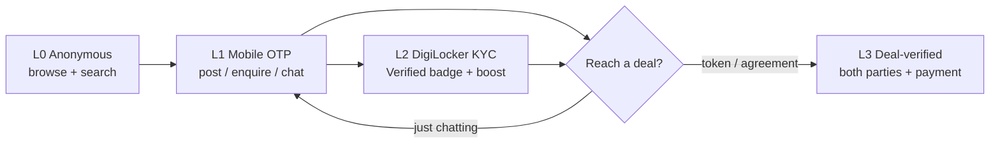
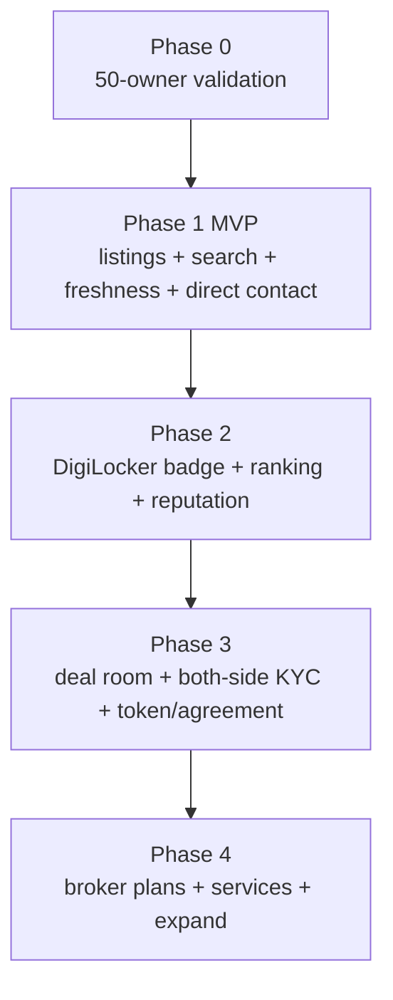

# PuneNest — Trust & Verification Model ("Badge, not Gate")

> **Status:** Product + architecture design, ratified direction. Supersedes the
> "KYC-everyone, hard-gate-at-posting" posture. Proposes **ADR-019** and amends
> **ADR-009a / ADR-009b** in `platform-architecture.md`.
> **Companion docs:** `platform-architecture.md` (seams, ADRs, KYC/payment flows),
> `BUSINESS_PLAN.md` (§2 wedges, monetisation), `cross-cutting.md` (contact gate).

---

## 0. The reframed thesis (why this version wins)

The Pune property market's real, thriving "product" today is **Facebook and Telegram
groups** — not NoBroker or 99acres. Seekers are there because those groups are:

- **Free**, **direct owner<->seeker**, **broker-optional**, and **community-driven**.

But those groups are broken where it hurts:

- No search / no filters, **rampant spam & scams**, **stale/already-gone posts**,
  **zero trust signals**, no memory, no structure.

> **PuneNest = the structured, trustworthy home for the market that currently lives in
> Facebook/Telegram groups.** Keep everything the groups do right (free, direct,
> broker-optional, communal); fix everything they do wrong (search, freshness, trust)
> — with **verification as a progressive trust layer, applied at moments of rising
> intent and money-at-risk, never as an upfront wall.**

Founder's lived pain, encoded as the north star:
1. **Seekers** hate brokers who charge heavily and show unworthy properties.
2. **Owners** can't reach genuine buyers/tenants on existing platforms.

If those two people meet directly, with trust, at low/zero brokerage — **that is the win.**

---

## 1. Design principles (the guardrails that stop us re-breaking it)

1. **Liquidity first, always.** Never block browsing or posting. An empty trustworthy
   marketplace loses to a messy liquid one. Friction is *always optional* and *always rewarded*.
2. **Progressive trust.** Verification escalates with **intent** and **money-at-risk**,
   not with page load.
3. **Carrot, not stick.** Verified users get **visibility, priority, badges, protection**.
   Unverified users are **not banned** — just ranked lower and clearly labelled.
4. **Transparency over exclusion.** Don't ban brokers — **label** them and let seekers
   filter. (This also becomes a revenue stream instead of a war.)
5. **Verify at the moment of vulnerability.** KYC appears exactly when the user *themselves*
   wants protection (token / agreement / handover). There, KYC is a *feature they ask for*,
   not friction we impose.
6. **Freshness is a bigger trust win than identity.** "Is it still available?" beats
   "is the owner Aadhaar-verified?" for everyday churn. Solve staleness first.

---

## 2. The Trust Ladder (four tiers)

| Tier | Name | How earned | Cost/friction | What it unlocks |
|---|---|---|---|---|
| **L0** | Anonymous | nothing | none | Browse all listings, search, filters, see locality/price. |
| **L1** | Mobile-verified | OTP login | ~zero (`OtpClient`) | Post a listing, enquire, save, chat request. **Baseline to participate.** |
| **L2** | Identity-verified (badge) | DigiLocker KYC (Cashfree Secure ID) | one-time, opt-in | **"Verified" badge**, ranking boost, "verified-only" filter eligibility, "Serious Buyer"/"Verified Owner" trust, faster responses. |
| **L3** | Deal-verified | Both parties KYC'd at deal step | required only here | Token/advance protection, digital rent agreement, e-stamp, deal room. |

**Rule of thumb:** everyone lives happily at **L1**. **L2** is *aspirational* (better
outcomes). **L3** is *transactional* (protects real money). We never force a user up a
tier to do something a Facebook group would let them do for free.

---

## 3. When to offer KYC — the core matrix

For each actor x moment: **offer** (passive), **nudge** (contextual prompt with value
prop), or **require** (block only this high-risk action). The value prop is the product.

### 3.1 Owner / Landlord

| Moment | Action | Value prop shown |
|---|---|---|
| Sign up / post first listing | **Nudge L2** (never require) | "Verified owners get **3x more genuine enquiries** + a Verified badge + higher search rank." |
| A **verified** seeker enquires | **Nudge L2** | "This buyer is verified. Verify yourself to unlock **direct chat** and build mutual trust." |
| Accept a token / issue agreement | **Require L3** | "To collect a token safely and generate a rent agreement, both sides verify. Protects you from fraud." |

### 3.2 Buyer / Tenant

| Moment | Action | Value prop shown |
|---|---|---|
| Browse / search | **nothing** (L0) | — |
| Save / enquire | **L1 mobile only** | "Verify your mobile to contact owners." |
| Contact a **verified** owner / want priority | **Nudge L2** | "Verified seekers get **2x faster owner responses** + a 'Serious Buyer' badge." |
| Pay token / sign agreement | **Require L3** | "Protect your money — pay only into a verified deal where the owner is verified too." |

### 3.3 Broker (allowed, labelled — not banned)

| Moment | Action | Value prop / rule |
|---|---|---|
| Sign up | **Self-declare** broker (honesty rule) | Posing as "owner" and getting caught => downrank/ban. Honesty is cheaper than the risk. |
| Want reach / credibility | **Offer L2 + "Verified Broker"** (KYC + optional RERA agent id) | "Verified Broker" badge + subscription/lead-pack reach. **This is broker revenue, opt-in.** |

**Why this is safe (unlike the old model):** posting stays free at L1, so **supply doesn't
collapse**; buyers browse and contact at L0/L1, so **demand doesn't bounce**; KYC lands at
L3 where users *want* it. We clean supply with **badges + ranking + freshness**, not walls.

---

## 4. Beating Facebook/Telegram without gates (the real moat)

These are what actually make us better than a group — and none of them is a KYC wall.

1. **Freshness engine (highest priority).** Every 72h send "**Still available?**"
   (WhatsApp/SMS/in-app via `NotificationClient`). One tap = stays live & gets a
   "**Fresh**" chip; no response in N days => auto-move to "availability unconfirmed" then
   expire. **Kills the #1/#2 churn drivers** (stale + already-gone listings) that groups
   and even incumbents can't fix.
2. **Duplicate / repost collapse.** Soft-cluster the same property (geo + BHK + area +
   image hash); show the freshest, fold the rest. Groups are full of the same flat posted
   ten times — we de-dupe the *listing*, softly, without banning the poster.
3. **Verified + Fresh ranking boost.** Search ranks **fresh, verified, responsive**
   listings first. Spam and stale sink naturally — carrot does the policing.
4. **Reputation signals.** Owner **response rate**, **avg time-to-reply**, **deals closed**
   shown on profile. Groups have zero memory; we make good behaviour visible.
5. **Community reporting.** One-tap "fake / broker posing as owner / already rented";
   thresholds trigger review. Crowd-sourced trust, cheap.
6. **Contact privacy (already designed).** Owner number masked (`98XXXXX210`) until a
   **contact request is approved** — request/approve, **not** KYC-gated (see `cross-cutting.md`).
   Kills spam-calling, the #1 reason owners hate portals, *without* an identity wall.

---

## 5. Business model that fits (money at the right layer)

Free where liquidity lives; paid where value/risk is real.

| Layer | Free | Paid (willingness-to-pay is high because...) |
|---|---|---|
| Discovery | Browse, search, filter, save | Featured / boosted listing (visibility) |
| Participation | Post (L1), enquire, chat request | "Verified" badge boost, verified-only reach |
| **Deal (primary revenue)** | — | **Digital rent agreement, e-stamp, token/escrow protection, tenant police-verification, both-side KYC** — real money & risk on the table |
| Supply pros | Owner posting | **Broker/agent subscription + lead packs** (labelled, opt-in) |
| Ancillary | — | Packers/movers, home services, home-loan referral, rent-pay |

**KYC cost recovery:** the ~Rs 3-10/verification is incurred at **L2 (opt-in)** and **L3
(deal)** — never burned on every anonymous signup. Cost follows value.

---

## 6. Phased build (maps to existing frontend + backend seams)

> **Phase 0 is a gate, not a suggestion.** No more backend features until it passes.

**Phase 0 — Validation (this month, no new code).**
Hand-recruit **50 real Pune owners/brokers** to (a) list a genuine property and
(b) optionally complete DigiLocker KYC for a badge. Google Form + WhatsApp + Cashfree
sandbox. **Pass = 50 fresh listings + evidence the badge earns better leads.** Fail =>
re-think before building.

**Phase 1 — MVP: the FB/Telegram replacement (liquidity).**
- Listings: post free at **L1 mobile**, search, filters, listing detail.
- Direct owner<->seeker **enquiry/chat**; **contact reveal on approved request** (masked
  until then) — *not* KYC-gated.
- **Freshness engine** (still-available ping + auto-expiry).  <- the differentiator
- "**Direct Owner**" vs "**Broker**" label + broker self-declare.

**Phase 2 — Trust layer: verification as a badge.**
- DigiLocker KYC (Cashfree Secure ID, **ADR-017**) => **Verified badge (L2)**.
- `identity_hash` (**ADR-009b**) awards **one Verified badge per human** (`UNIQUE`), enforced
  **inside the opt-in KYC flow only** — off the posting path, so it never gates participation (see §7).
- **Verified + Fresh ranking boost**; "verified-only" filter; reputation signals.

**Phase 3 — Deal layer: KYC where users want it + monetisation.**
- Deal/token flow => **L3 both-party verify**, digital agreement, token via Cashfree PG
  (**ADR-017**), escrow-style protection, e-stamp.

**Phase 4 — Scale.**
- Analytics, broker subscriptions, ancillary services, next Pune localities, then next city.

---

## 7. Architecture impact — ADR-019 (proposed) + amendments

This model **changes the enforcement posture** locked earlier. Record in
`platform-architecture.md`:

- **ADR-019 (new) — Progressive trust: "verification as a badge, not a gate."**
  Verification is **opt-in and incentivised** (ranking, badges, faster response,
  deal protection), enforced **only at L3** (money/agreement). MVP posting and buyer
  contact stay at **L1 mobile**. *Reason:* forcing KYC on both sides at posting is
  supply-side-suicidal cold-start (see BUSINESS_PLAN §2 and the trade-off analysis).
  *Impact:* touches ranking, listing lifecycle, and the KYC prompt placement — not the
  KYC integration itself (seams unchanged).

- **ADR-009a (amend) — mobile-match becomes soft everywhere at MVP.**
  Was: *owners posting hard-require `webhook.mobile == A`.* Now: **soft-flag for everyone**
  as a trust signal; **hard mobile-match only at L3** (deal/agreement), with admin override.
  Posting no longer blocks on mobile-match.

- **ADR-009b (clarify) — `identity_hash` stays `UNIQUE` (one Verified badge per human), but its
  `409` fires only inside the *opt-in* KYC/badge flow.**
  Because KYC is off the posting path, one-badge-per-identity no longer gates participation:
  unverified users still post at L1. Spam by unverified posters is handled by **mobile-OTP +
  freshness + ranking**, not identity. Aadhaar Vault full-number token remains the deferred
  upgrade for court-grade uniqueness.

**Unchanged (still law):** Cashfree seams (`KycClient`, `PaymentClient`, `NotificationClient`,
`OtpClient`), DigiLocker consent flow, DPDP posture (raw Aadhaar never stored), contact
request/approve privacy, soft-delete, free-tier-first.

---

## 8. Success metrics (and the anti-friction guardrail)

- **North star:** genuine **deals closed direct** (no/low brokerage) per month.
- **Supply health:** verified-fresh listings per locality; % listings answering the
  freshness ping.
- **Demand health:** enquiry -> owner-response rate; time-to-first-response.
- **Trust:** % L3 deals with both parties verified; fraud/report rate per 1k listings.
- **Guardrail metric:** drop-off at **each KYC nudge**. **If a nudge lowers conversion,
  move it later down the ladder.** KYC must never appear before a value moment.

---

## 9. Top risks & mitigations

| Risk | Mitigation |
|---|---|
| Phase-2 KYC creeps back into Phase-1 posting (the original mistake) | ADR-019 makes L1 posting the hard contract; review any prompt that blocks posting. |
| Cold-start (empty marketplace) | Hyperlocal density (BUSINESS_PLAN §2) + seed by migrating a few Pune FB/Telegram communities in Phase 0/1. |
| Freshness-ping fatigue | Tune cadence; one-tap confirm; escalate channel only on silence. |
| Broker backlash to labelling | Give brokers a paid, *better* lane (Verified Broker + leads) — co-opt, don't fight. |
| DigiLocker/DPDP compliance & cost | Already handled in platform-architecture §6.4/§9; cost now only at L2/L3. |

---

## 10. Open questions (decide before/along Phase 1)

1. **Freshness cadence & expiry:** 72h ping, expire after how many misses (3? 5?)?
2. **Contact reveal at L1:** approved-request reveals full number, or in-app chat only until L2?
3. **Broker lane:** allow at MVP (labelled) or defer to Phase 4? (Recommend allow+label from day 1 — they are supply.)
4. **Which 5 Pune localities** to dominate first (density target)?
